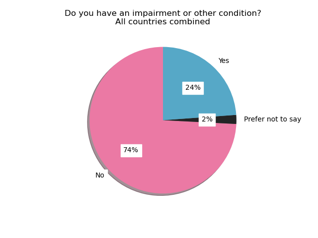
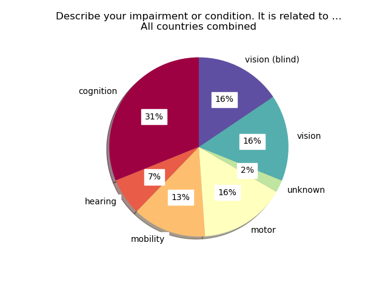
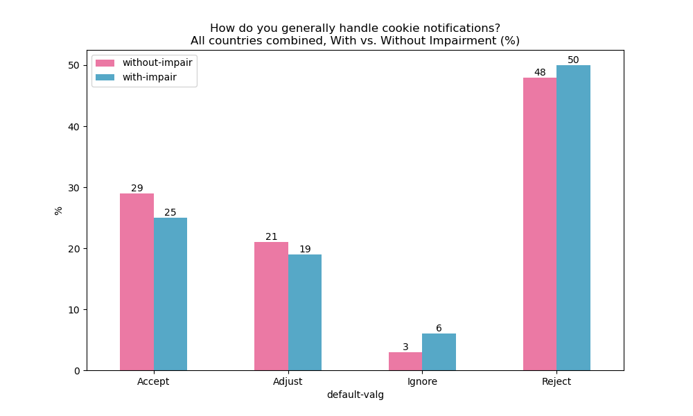
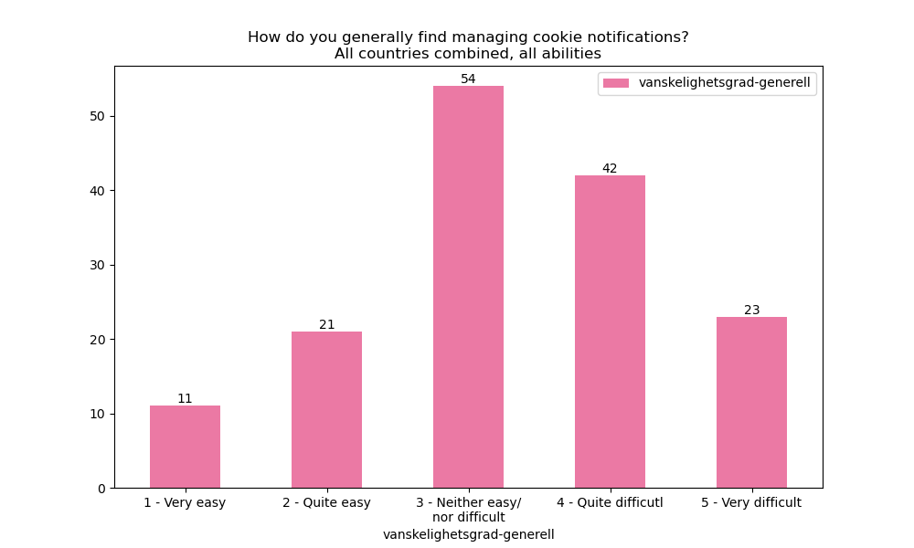

# Results from the survey

## 1. How old are you? (All countries combined)


```
                    alder
alder                    
19 - 30 years           5
31 - 49 years          38
50 - 65 years          35
66 years and older     73
```

## 2. Are you ...? (All countries combined)


```
            kjonn
kjonn            
Female         88
Male           59
Non-Binary      4
```

## 3. Do you have an impairment or other condition? (All countries combined)



```
                      funksjonsnedsettelse
funksjonsnedsettelse                      
Ja                                      36
Nei                                    112
Ønsker ikke å oppgi                      3
```

## 9. Describe your impairment or condition. It is related to … (All countries combined)



```
                                funksjonsnedsettelse-type-kode
funksjonsnedsettelse-type-kode                                
hørsel                                                       3
kognisjon                                                   14
mobilitet                                                    6
motorikk                                                     7
syn                                                          7
syn (blind)                                                  7
ubestemt                                                     1
```

## 4. How often do you use the internet? (All countries combined)


```
                      internettvaner
internettvaner                      
Daily                             36
Multiple times a day             112
Weekly                             3
```

## 5. How do you generally handle cookie notifications? (All countries combined)

### Subset With vs. Without Impairment (%)



### Subset With vs. Without Impairment (Total #)


```
              without-impair  with-impair
default-valg                             
Accept                    32            9
Adjust                    23            7
Ignore                     3            2
Reject                    54           18
```

### Subset all abilities


```
              default-valg
default-valg              
Accept                  42
Adjust                  30
Ignore                   5
Reject                  74
```


## 6. How do you generally find managing cookie notifications? (All countries combined)

### Subset With vs. Without Impairment (%)


### Subset With vs. Without Impairment (Total #)


```
                                  without-impair  with-impair
vanskelighetsgrad-generell                                   
1 - Very easy                                  8            2
2 - Quite easy                                18            3
3 - Neither easy/\nnor difficult              40           13
4 - Quite difficutl                           33            8
5 - Very difficult                            13           10
```

### Subset all abilities



```
                                  vanskelighetsgrad-generell
vanskelighetsgrad-generell                                  
1 - Very easy                                             11
2 - Quite easy                                            21
3 - Neither easy/\nnor difficult                          54
4 - Quite difficutl                                       42
5 - Very difficult                                        23
```


## 7. What do you generally think about the text in cookie notifications? (All countries combined)

### Subset With vs. Without Impairment (%)


### Subset With vs. Without Impairment (Total #)


```
                                  without-impair  with-impair
vanskelighetsgrad-tekst                                      
-1 - No answer                                 1            1
1 - Very easy                                  9            4
2 - Quite easy                                11            2
3 - Neither easy/\nnor difficult              41            9
4 - Quite difficutl                           35           13
5 - Very difficult                            15            7
```

### Subset all abilities


```
                                  vanskelighetsgrad-tekst
vanskelighetsgrad-tekst                                  
-1 - No answer                                          2
1 - Very easy                                          13
2 - Quite easy                                         14
3 - Neither easy/\nnor difficult                       51
4 - Quite difficutl                                    48
5 - Very difficult                                     23
```


## 8. Is it generally easy or difficult to make choices for cookies? (All countries combined)

### Subset With vs. Without Impairment (%)


### Subset With vs. Without Impairment (Total #)


```
                                  without-impair  with-impair
vanskelighetsgrad-valg                                       
1 - Very easy                                 18            7
2 - Quite easy                                17            3
3 - Neither easy/\nnor difficult              28            3
4 - Quite difficutl                           38           15
5 - Very difficult                            11            8
```

### Subset all abilities


```
                                  vanskelighetsgrad-valg
vanskelighetsgrad-valg                                  
1 - Very easy                                         25
2 - Quite easy                                        21
3 - Neither easy/\nnor difficult                      32
4 - Quite difficutl                                   53
5 - Very difficult                                    20
```
