# Results from the survey

## 1. Hvor gammel er du? (Alle land)

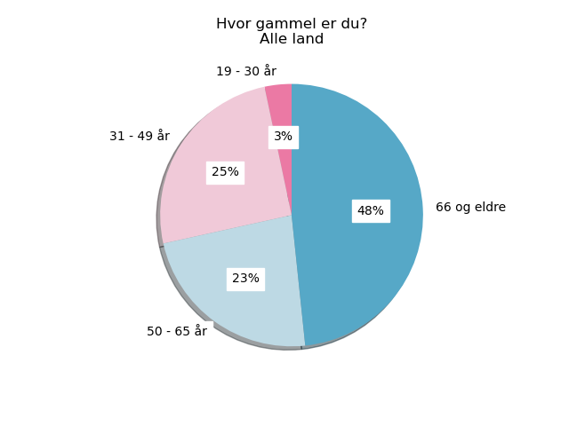

```
             alder
alder             
19 - 30 år       5
31 - 49 år      38
50 - 65 år      35
66 og eldre     73
```

## 2. Er du ...? (Alle land)

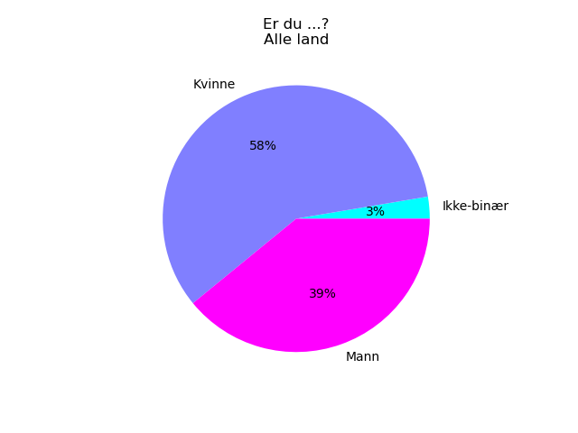

```
            kjonn
kjonn            
Ikke-binær      4
Kvinne         88
Mann           59
```

## 3. Har du en funksjonsnedsettelse eller annen tilstand? (Alle land)

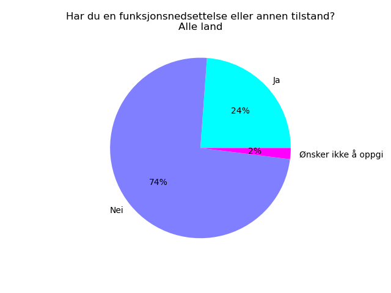

```
                      funksjonsnedsettelse
funksjonsnedsettelse                      
Ja                                      36
Nei                                    112
Ønsker ikke å oppgi                      3
```

## 9. Beskriv funskjonsnedsettelsen din. Den er relatert til … (Alle land)

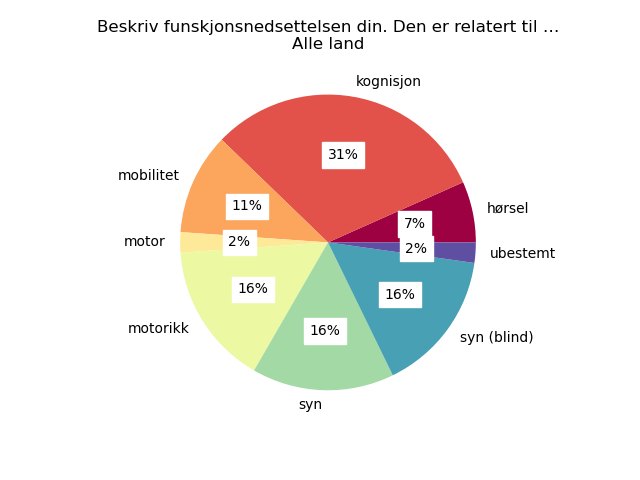

```
                                funksjonsnedsettelse-type-kode
funksjonsnedsettelse-type-kode                                
hørsel                                                       3
kognisjon                                                   14
mobilitet                                                    5
motor                                                        1
motorikk                                                     7
syn                                                          7
syn (blind)                                                  7
ubestemt                                                     1
```

## 4. Hvor ofte bruker du Internett? (Alle land)

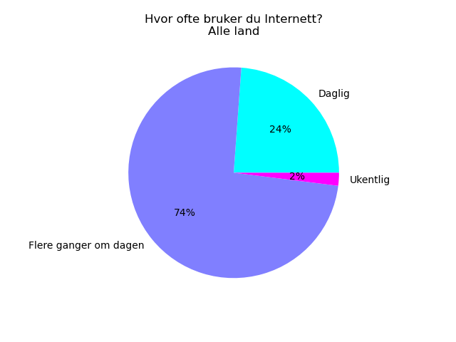

```
                       internettvaner
internettvaner                       
Daglig                             36
Flere ganger om dagen             112
Ukentlig                            3
```

## 5. Hvordan håndterer du varsler om informasjonskapsler? (Alle land)

### Subset Med vs. Uten funksjonsnedsettelse (%)

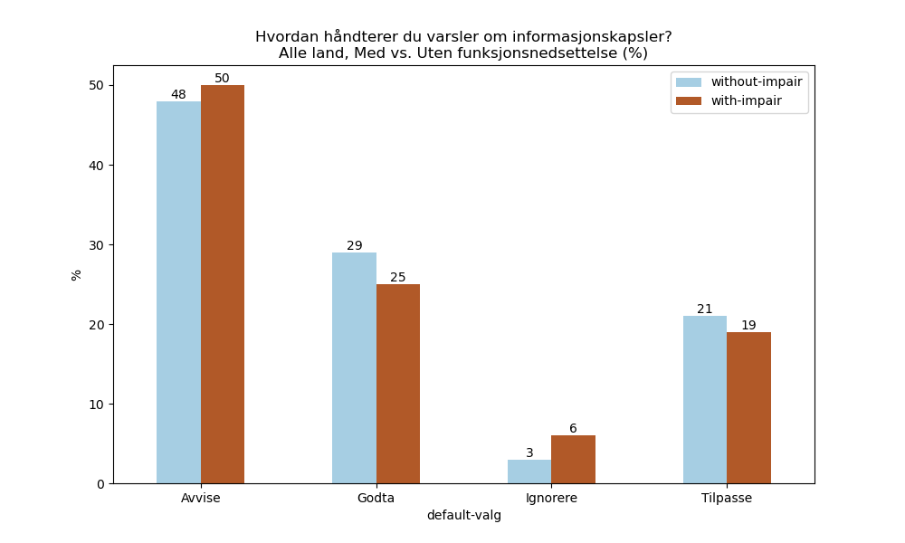

### Subset Med vs. Uten funksjonsnedsettelse (Total #)

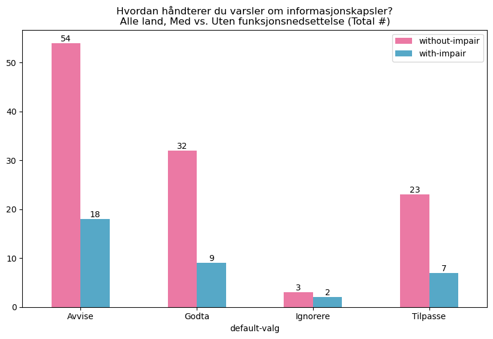

```
              without-impair  with-impair
default-valg                             
Avvise                    54           18
Godta                     32            9
Ignorere                   3            2
Tilpasse                  23            7
```

### Subset uansett funksjonsevne


```
              default-valg
default-valg              
Avvise                  74
Godta                   42
Ignorere                 5
Tilpasse                30
```


## 6. Hvordan opplever du generelt sett å håndtere varsler om informasjonskapsler? (Alle land)

### Subset Med vs. Uten funksjonsnedsettelse (%)


### Subset Med vs. Uten funksjonsnedsettelse (Total #)

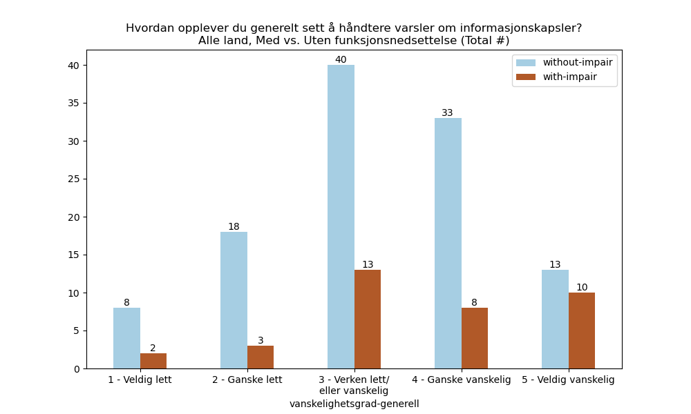

```
                                   without-impair  with-impair
vanskelighetsgrad-generell                                    
1 - Veldig lett                                 8            2
2 - Ganske lett                                18            3
3 - Verken lett/\neller vanskelig              40           13
4 - Ganske vanskelig                           33            8
5 - Veldig vanskelig                           13           10
```

### Subset uansett funksjonsevne

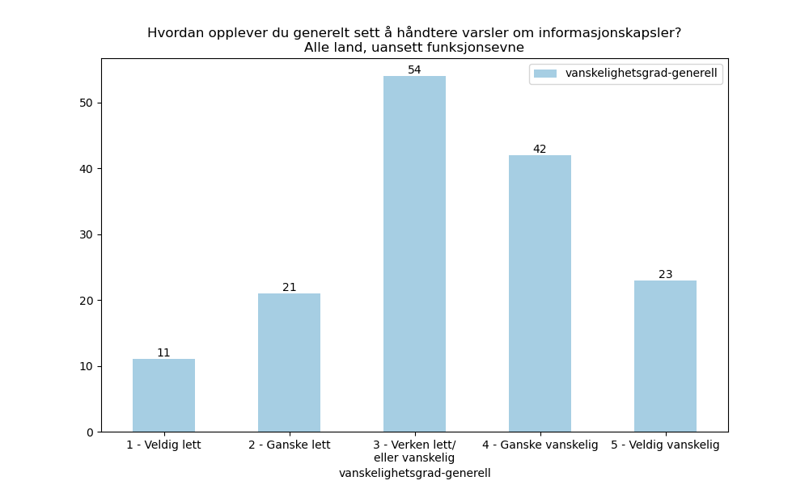

```
                                   vanskelighetsgrad-generell
vanskelighetsgrad-generell                                   
1 - Veldig lett                                            11
2 - Ganske lett                                            21
3 - Verken lett/\neller vanskelig                          54
4 - Ganske vanskelig                                       42
5 - Veldig vanskelig                                       23
```


## 7. Hva synes du generelt om teksten i varsler om informasjonskapsler? (Alle land)

### Subset Med vs. Uten funksjonsnedsettelse (%)

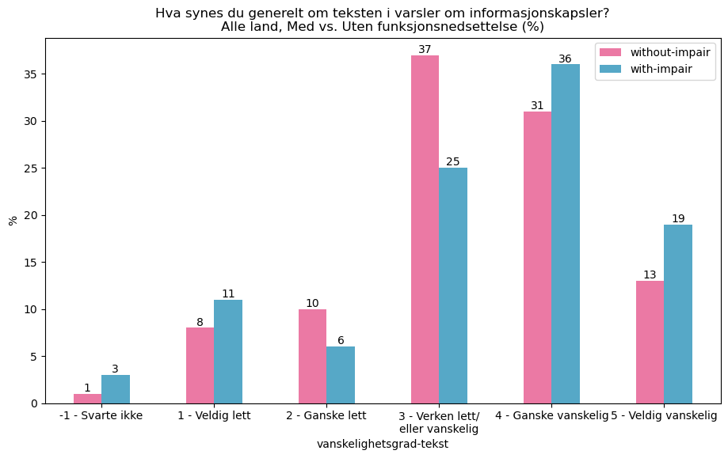

### Subset Med vs. Uten funksjonsnedsettelse (Total #)

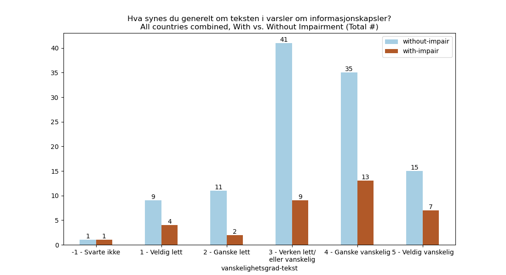

```
                                   without-impair  with-impair
vanskelighetsgrad-tekst                                       
-1 - Svarte ikke                                1            1
1 - Veldig lett                                 9            4
2 - Ganske lett                                11            2
3 - Verken lett/\neller vanskelig              41            9
4 - Ganske vanskelig                           35           13
5 - Veldig vanskelig                           15            7
```

### Subset uansett funksjonsevne

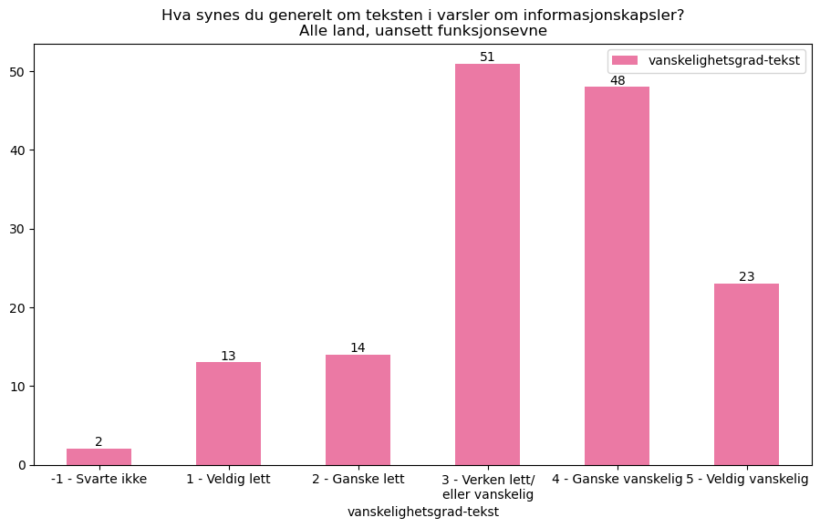

```
                                   vanskelighetsgrad-tekst
vanskelighetsgrad-tekst                                   
-1 - Svarte ikke                                         2
1 - Veldig lett                                         13
2 - Ganske lett                                         14
3 - Verken lett/\neller vanskelig                       51
4 - Ganske vanskelig                                    48
5 - Veldig vanskelig                                    23
```


## 8. Er det generelt lett eller vanskelig å ta valg for informasjonskapsler? (Alle land)

### Subset Med vs. Uten funksjonsnedsettelse (%)

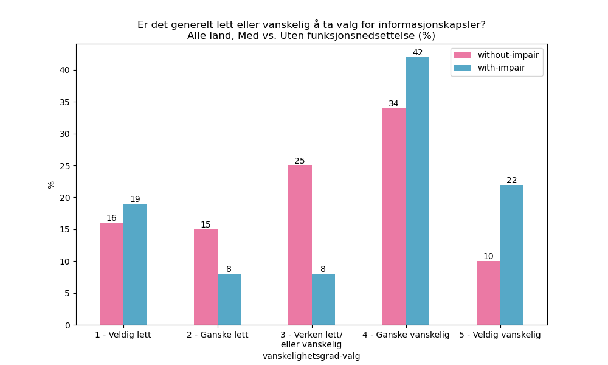

### Subset Med vs. Uten funksjonsnedsettelse (Total #)

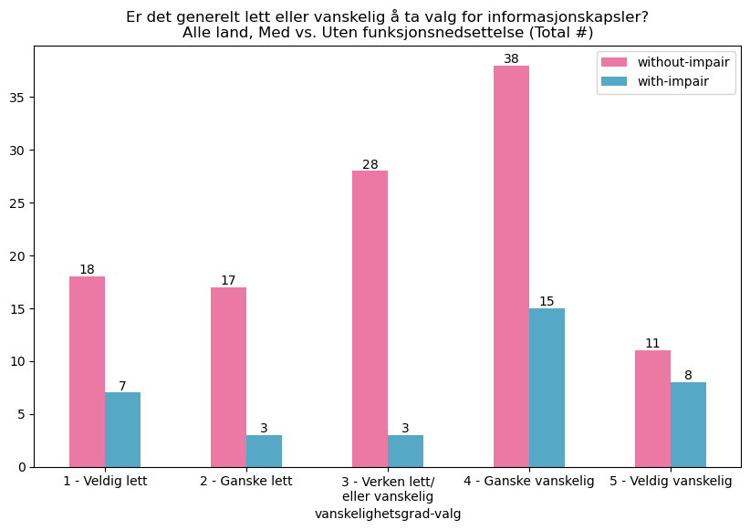

```
                                   without-impair  with-impair
vanskelighetsgrad-valg                                        
1 - Veldig lett                                18            7
2 - Ganske lett                                17            3
3 - Verken lett/\neller vanskelig              28            3
4 - Ganske vanskelig                           38           15
5 - Veldig vanskelig                           11            8
```

### Subset uansett funksjonsevne

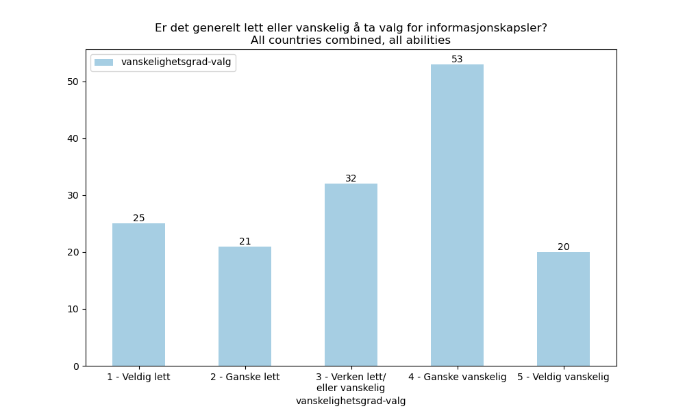

```
                                   vanskelighetsgrad-valg
vanskelighetsgrad-valg                                   
1 - Veldig lett                                        25
2 - Ganske lett                                        21
3 - Verken lett/\neller vanskelig                      32
4 - Ganske vanskelig                                   53
5 - Veldig vanskelig                                   20
```
