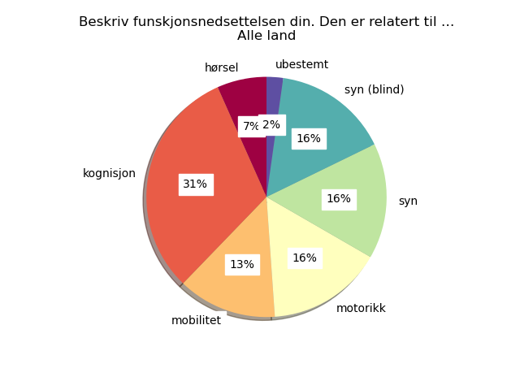

# Results from the survey

## 1. Hvor gammel er du? (Alle land)


```
             alder
alder             
19 - 30 år       5
31 - 49 år      38
50 - 65 år      35
66 og eldre     73
```

## 2. Er du ...? (Alle land)


```
            kjonn
kjonn            
Ikke-binær      4
Kvinne         88
Mann           59
```

## 3. Har du en funksjonsnedsettelse eller annen tilstand? (Alle land)


```
                      funksjonsnedsettelse
funksjonsnedsettelse                      
Ja                                      36
Nei                                    112
Ønsker ikke å oppgi                      3
```

## 30. Beskriv funskjonsnedsettelsen din. Den er relatert til … (Alle land)



```
                                funksjonsnedsettelse-type-kode
funksjonsnedsettelse-type-kode                                
hørsel                                                       3
kognisjon                                                   14
mobilitet                                                    6
motorikk                                                     7
syn                                                          7
syn (blind)                                                  7
ubestemt                                                     1
```

## 4. Hvor ofte bruker du Internett? (Alle land)


```
                       internettvaner
internettvaner                       
Daglig                             36
Flere ganger om dagen             112
Ukentlig                            3
```

## 5. Hvordan håndterer du varsler om informasjonskapsler? (Alle land)

### Subset Med vs. Uten funksjonsnedsettelse (%)


### Subset Med vs. Uten funksjonsnedsettelse (Total #)


```
              without-impair  with-impair
default-valg                             
Avvise                    54           18
Godta                     32            9
Ignorere                   3            2
Tilpasse                  23            7
```

### Subset uansett funksjonsevne


```
              default-valg
default-valg              
Avvise                  74
Godta                   42
Ignorere                 5
Tilpasse                30
```


## 6. Hvordan opplever du generelt sett å håndtere varsler om informasjonskapsler? (Alle land)

### Subset Med vs. Uten funksjonsnedsettelse (%)


### Subset Med vs. Uten funksjonsnedsettelse (Total #)


```
                                   without-impair  with-impair
vanskelighetsgrad-generell                                    
1 - Veldig lett                                 8            2
2 - Ganske lett                                18            3
3 - Verken lett/\neller vanskelig              40           13
4 - Ganske vanskelig                           33            8
5 - Veldig vanskelig                           13           10
```

### Subset uansett funksjonsevne


```
                                   vanskelighetsgrad-generell
vanskelighetsgrad-generell                                   
1 - Veldig lett                                            11
2 - Ganske lett                                            21
3 - Verken lett/\neller vanskelig                          54
4 - Ganske vanskelig                                       42
5 - Veldig vanskelig                                       23
```


## 7. Hva synes du generelt om teksten i varsler om informasjonskapsler? (Alle land)

### Subset Med vs. Uten funksjonsnedsettelse (%)


### Subset Med vs. Uten funksjonsnedsettelse (Total #)


```
                                   without-impair  with-impair
vanskelighetsgrad-tekst                                       
-1 - Svarte ikke                                1            1
1 - Veldig lett                                 9            4
2 - Ganske lett                                11            2
3 - Verken lett/\neller vanskelig              41            9
4 - Ganske vanskelig                           35           13
5 - Veldig vanskelig                           15            7
```

### Subset uansett funksjonsevne


```
                                   vanskelighetsgrad-tekst
vanskelighetsgrad-tekst                                   
-1 - Svarte ikke                                         2
1 - Veldig lett                                         13
2 - Ganske lett                                         14
3 - Verken lett/\neller vanskelig                       51
4 - Ganske vanskelig                                    48
5 - Veldig vanskelig                                    23
```


## 8. Er det generelt lett eller vanskelig å ta valg for informasjonskapsler? (Alle land)

### Subset Med vs. Uten funksjonsnedsettelse (%)


### Subset Med vs. Uten funksjonsnedsettelse (Total #)


```
                                   without-impair  with-impair
vanskelighetsgrad-valg                                        
1 - Veldig lett                                18            7
2 - Ganske lett                                17            3
3 - Verken lett/\neller vanskelig              28            3
4 - Ganske vanskelig                           38           15
5 - Veldig vanskelig                           11            8
```

### Subset uansett funksjonsevne


```
                                   vanskelighetsgrad-valg
vanskelighetsgrad-valg                                   
1 - Veldig lett                                        25
2 - Ganske lett                                        21
3 - Verken lett/\neller vanskelig                      32
4 - Ganske vanskelig                                   53
5 - Veldig vanskelig                                   20
```


## 9. Kan du gi et eksempel på noe du synes er vanskelig med cookies? (Alle land)

Antall svar: 107

* ikke lik utforming. må lese og velge riktig for avvising
* Skriftstørrelse
* Jeg skjønner ikke hva "legitime interesser" betyr. Altså "vi ber ikke om samtykke, men innhenter info for våre legitime interesser" eller tilsvarende. Neien ganger er det likevel en samtykke knapp, så du kan si nei, men det føles ikke som et nei når de sier at de ikke bryr seg om samtykket mitt.
* ja, de er løgnaktige spionerings  redskaper!
* Vanskelig å forstå poenget. Gikk kjappere da det ikke kom opp info kapsler
* Informasjon blir gjemt
* Varierende plassering+formattering av knapper. Det krever mye energi å avvise "legitime interesser" som kan komme som 5+ underkategorier.
* På enkelte nettsteder er det forhåndsutfylt at du godtar informasjonskapsler, og da ofte på 6-7 alternativer. Da må du inn på alle alternativene og trykke vekk godtar.
* Nei
* Mange klikk og du må ta deg tid til å lese det
* For mange valg, utydelig info, flere fliker å lese gjennom
* Det kommer ofte i veien, så mister jeg fokus over det jeg skulle.
* dersom man må godta for å bruke nettstedet istedet for å avvise og avslutte
* Mye å lese
* Når jeg må hake av (eller fjerne hake) fra en drøss med punkter for å kunne avslå
* Knapper for å slå av og på kategorier i teksten gjentar ofte all tekst som er skrevet før selve knappen. Man får heller ikke vite om det er en knapp man kan trykke på eller ikke før på slutten av teksten. Det virker som om informasjon om cookies og valg er gjort så vanskelig at man skal gå lei og trykke godta alle.
* Ofte masse tett skrevet tekst med veldig små bokstaver
* Iriterende
* mye tekst, gidder ikke lese, er travel
* Dersom man må gå igjennom alle alternativer og behandle det enkelte.
* For lang vei inn til avvisning
* Føler ofte at jeg egentlig ikke har et reelt valg, men må akseptere cookies
* Vet ikke hva de skj7ler
* ingenting
* At jeg egentlig ikke har noen kontroll på hvordan opplysningene om meg kan bli brukt eller om hvor de havner.
* Vanskelig å forstå konsekvensene av å avslå, hvilke tjenester på siden blir ikke tilgjengelig.
* Vil ikke si det er noe vanskelig.
* ikke alltid lett å forstå konsekvensene av ulike valg
* Mer irriterende enn vanskelig
* Synes de bruker et vanskelig og omstendelig språk
* Kan brukes til svindel
* Avviser alle som kan avvises men irriterende at d ofte er «skjulte» undervarsler som er lett å overse
* Har ikke helt forståelsen for om man godtar for mye opplysning om deg selv
* Ikke eksempel men generelt vanskelig språk i teksten. Og mange valg som må gjøres
* Av og til usikker på hva som gjelder funksjonalitet og hva som gjelder reklamestyring.
* Det er tidkrevende og ikke motiverende  å lese de lange forklaringene. Livet er for kort til å bruke tid på dette.
* Når du må godta alle informasjonskapsler. Synes det er skummelt og går da ut fra nettstedet.
* nei
* Tidkrevende å lese alt.
* Når det ikke er avklart om det gis adgang til interessant tema uten at diverse cookies aksepterres.Redusere
* Om hvem kan ha tilgang til info om meg
* Enkelte sider gjemmer budskapet om sletting veldig godt.
* Ikke spesielt
* Er infokapsler nødvendig
* Ingen
* Har egentlig ikke opplevd noe som har vært vanskelig med informasjonskapsler
* Blir fort irritert, vil ha raske svar på det jeg er interessert i
* Å forstå hva de betyr.
* Det har blitt en lang dag, og jeg orker ikke forholde meg til dette og det neste spørsmålet. Så jeg vil bare si at informasjonskapsler og varsler ødelegger mye for seniorer som ikke kommer videre.
* Nødvendige cookies??
* For lange
* Neien sider forutsetter bare at man godtar informasjonskapsler. Andre skjuler i praksis mulighetene til å velge noe annet enn "godta alle".
* Særlig hvis det er på engelsk
* Konsekvenser av å ikke tillate "alle cookies"
* Masse tekst, så jeg bare godtar.
* Ingen vansker
* Når det ikke er mulig å komme videre uten. Å ha tatt et valg
* Mange gjør det vanskelig å avvise informasjonskapsler eller å kun velge nødvendige.
* Info kapsler er en stor plage. Det er også Meta og Schibsted, de kjører over meg som dampveivalser.
* Ofte forsvinner samtykkevinduet før jeg får svart. Jeg har Adblock Plus,  Adblocker Ultimate,   Privacy Possum og Ghostery på Firefox som jeg bruker mest. Ofte blir da nettsider umulige å bruke og jeg må bruke en annen nettleser for akkurat denne nettsiden.
* Vanskelig å forstå hva som samles inn av  personlig og GEO informasjon. Kapslene kan vel leses sv andre firma og organisasjoner.
* Hvor du må akseptere for å komme videre
* Litt lire og uklare spørsmål, mest egnet til feilvalg
* .
* Skjønner ikke hva det betyr, hverken cookies eller infokapsler.
* Skjønner ikke hva det betyr?
* Dersom bank, offentlig eller forsikring ber om godkjenning
* Neien gjør det veldig tungvint
* ubegripelig hva man egentlig samtykker eller ikke til
* Det er ingenting som jeg synes er vanskelig med informasjonskapsler
* Det finns ingen logisk ordning eller standard för i vilken ordning alternativen kommer. Det blir svårt att välja det alternativ jag vill ha. Trycker fel många gånger pga detta.
* Att välja "enbart nödvändiga cookies". Ibland ligger valet nästan gömt och notiserna funkar ofta dåligt på mobilen - här måste webbplatser bli mycket bättre!
* Själva notisen i sig är ofta onödigt störande. Cookies som är strikt nödvändiga för att sidan ska fungera behöver man t.ex. inte alls fråga om samtycke för. Vidare är det ibland väldigt många rutor att kryssa ur om man inte vill ha cookies kopplade till reklam/profilering etc.
* Tycker inte det är svårt utan snarare irriterande.
* Alla notiser ser olika ut och det gör det ännu mer irriterande när jag bara vill avvisa rubbet.
* Oftast känner jag inte att jag har tid med att sitta och läsa igenom den informationen på varje sida jag besöker. Jag vill kunna ta ett snabbt beslut. Utseendet i cookie-notiser skiljer sig mycket åt och det är ibland svårt att få en snabb överblick över vila val jag kan göra och vad de innebär.
* Ibland upplever jag att de inte går att välja bort. Att det enda alternativet som visas är att acceptera cookies - och i dessa fall gör jag det för att komma vidare på sidan. Då läser jag oftast inte den tillhörande texten.
* Det bör alltid finnas alternativ. Man måste kunna fortsätta på sidan utan att godkänna.
* Ofta svårt att ta bort
* Att ha tålamod och ork att stanna upp, läsa, bestämma, klicka - när man egentligen bara vill vidare till själva sidan
* En del notiser ger möjligheten att se fler inställningar, men sedan kan man inte komma vidare om man inte godkänner allt.  På en del notiser har man bara valet att acceptera eller kryssa bort. Vad innebär det om jag kryssar ned notisen? Har jag accepterat då?
* Det är för mycket text - de är ju ett nödvändigt ont som det verkar, och då borde det finnas kortare text med tillval om man vill veta mer. Man vill bara förbi det.
* De är ivägen, tar upp för mycket plats. Lätt att trycka på "fel knapp".
* Alltså det är inte svårt, men en del har långa listor där man måste klicka ur att man inte vill på många ställen istället för att ha en knapp med avvisa alla.
* Svårt och svårt, men det är väldigt irriterande många gånger. Ibland gör företaget att knappen som de vill att man ska trycka på (att acceptera alla cookies) är grönmarkerad så man lätt ska trycka på den. För att bara acceptera nödvändiga cookies så kan man som användare många gånger få gå en omständig väg, genom att läsa mer, och bocka ur massor av alternativ, då en knapp för "endast nödvändiga" inte finns. Det blir alltså mer av ett straff att inte vilja bli spårad mer än nödvändigt. många gåner accepterar man bara för det är så jädra besvärligt helt enkelt. Det är inte helt okej i min mening.
* Att man på många sajter måste klicka bort alla jäkla rutor på leverantörer som ska sno min data, dvs de fall där man inte bara kan välja att förkasta alla med en knapptryckning.
* Ni har missat alternativet på först frågan om cookies. Jag läser aldrig texten men jag godkänner ibland när jag inte orkar försöka lista ut hur jag avvisar. Det gick inte att välja. Svårt att avvisa på vissa för det går inte alls eller så är det gömt i inställningar där man inte förstår hur man gör för att avvisa för knapparna är lurigt namngivna.
* Everyone of them works slightly differently. I always have to look where the reject option is. Sometimes the button to reject them looks like it's not enabled. Sometimes you can only accept them, if you want to continue. Sometimes it's difficult to undo rejecting the cookies, if I decide to watch an embedded youtube video and cookies need to be accepted for that.
* Cookie notifications often seem built to make it hard to reject cookies. In many cases, it is necessary to click on several boxes to consent or reject for individual uses of personal data or individual vendors or third parties
* Don't really understand it
* 1) Legal language and not easy to understand language. E.g. what info will be stored about me if saying yes to either functional or all cookies? 2) Manipulative cookie notifications where I need to manually choose NOT to have cookies.
* too much text
* Variability in the notices makes it harder to find the response you want. Usually I refuse all unnecessary cookies, and sometimes that's very easy, sometimes you have to drill down further. Much better over the last few years though since people were required to let users opt out.
* To reject advertising
* Some websites allow a person to 'reject all', which is really helpful; others do not, and one has to toggle permission for each company.  Additionally, some websites automatically allow access by 'legitimate interests', and again, to disallow access, permission for each individual interest must be toggled.
* Jag kan inte acceptera att jag avkrävs ett svar på om jag vill bidra till att förse någon med information om mig, utan vill att min ignorans (= utan reaktion från min sida) skall tolkas som att jag bara godkänner det som är absolut nödvändigt för att besöket skall fungera.
* Att hitta hur man kan avvisa åtminstone alla icke-nödvändiga. Att utformning och ordval är olikt från sida till sida. Man vill bara ignorera eller avvissa allt direkt, men eftersom det utformas på olika sätt behöver man nästan alltid läsa och ofta gå in i inställningar om man inte bara vill godkänna. Så det blir också ofta att ignorera för orkar inte med. Särskilt inte eftersom det kommer vid varje hemsida.
* Att det alltid är olika gränssnitt för hur man ska godkänna. Det krävs allt från ett klick på valknapp till ibland 4 klick och att behöva skrolla ner till slutet och godkänna alla val. Ibland undrar man vad "Godkänna alla" betyder.
* Om jag ska bara ge ett exempel så utifrån min autism skulle jag säga att det är svårt och utmattande för huvudet att göra en avvägning om webbplatsens innehåll är värt vad de vill sätta för cookies och svårt att förstå konsekvenser av att acceptera cookies.
* Inget är svårt med själva innehållet. De är bara oerhört frustrerande!
* The text should be easier, short and understandable. The most important should come first and then the rest of the text matter less unless you want to fully understand what you accept. The buttons should be bigger with bigger contrasts.
* As I work in Higher Education digital, I spend a lot of time supporting academics and students with issues caused through web browsing, settings, cookies, caches etc. Institutional and 3rd party systems settings, lack of understanding by users, and unnecessarily complex or hidden processes and language for managing all, contribute to our end users pain. Currently the Microsoft Teams caches is causing huge issues with our LTI integration set up for Assessments for example, taking up an inordinate amount of our resource supporting staff with this.
* the buttons or decissions are not accessible
* makes me frustrated and its hard to make a conscious choice so I just accept to get them out of the way, but sometimes it feels like a rushed maybe stupid decision. It feels draining to have them everywhere all the time
* They don't always get focus, they don't always have a quick button to reject. Sometimes it's hard for a screen user to understand if some choices are on or off. Sometimes they hinder the site to be used unless you deal with them, and dealing is sometimes inaccessible. They are annoying.
* some websites say agree or pay. that's concerning. What info are they keeping and why are they needed?
* In certain instances the options you are given on cookies are skewed in your acceptance of the cookies in one form or another and there may be no option to outright reject them. The whole cookie concept is ok but open to abuse by some.

## 10. Har du en idé om hvordan cookie-bannere kan gjøres enklere å forstå og administrere? (Alle land)

Antall svar: 109

* Sørg for at barenødvendige blir det tydelig og synlig valg på alle sider. Eventuelt, sett dette som standard, slik at man slipper å velge.
* standardiserte
* Opplesing
* Standardisert utforming og "ingen cookies" som standard svar, slik at "enter"-knappen automatisk sier nei til alle
* gi faen i all spionering! men, det er umulig, dette er laget før uønsket spionering på brukere!
* Gå sammen med EU og fjern de. Helt unyttig for en som sitter å surfer på nett i det daglige liv. Bare til irritasjon
* Fargevalget på knappene for avvising og godkjenning
* Pålagt med knapp for "avvis alle" som også avviser kategorien "legitime interesser." Tydelige retningslinjer om hvordan disse menyene bør utformes, slik at de ikke varierer fra nettsted til nettsted.
* Forenkle til to valg; kun nødvendige eller godta alle
* Standardisering av info kapsler
* Har ingen
* Enklere språk og færre klikk
* Alt på en plass, stort, oversiktlig og eksplisitt hva man aksepterer og ikke aksepterer
* Det bør være et symbol du kan trykke på hvis du vil lese.
* sett opp "AVVIS ALLE" alternativet lett tilgjengelig istedet for å skjule avvis-funksjonen
* Lite tekst på norsk
* Definitivt ALLTID ha en knapp som er "avvis alle". Neien nettsteder har dette, andre må man avvise hver enkelt punkt, og så til slutt når du har manuelt fjernet tillatelsen kommer endelig "avvis alle" opp.IKKE ha markering av boksen som er "godta alle". Innimellom trykker jeg nesten automatisk på denne, selv om jeg absolutt ikke vil godta alle.Det hadde også vært fint om, når det kommer en lang liste med tredjeparter eller funksjoner, man kunne kollapse kategorier slik at jeg ikke må  scrolle i et halvt minutt for å komme meg nederst.Neien ganger står det at en tredjepart har "berettiget interesste"/"legitimate interest". Jeg vil gjerne ha forklaring og begrunnelse for HVORFOR denne aktøren mener interessen deres er berettiget, og eventuelt hva de har tenkt å bruke informasjonen til, slik at jeg kan ta et informert valg på om jeg vil godta/avslå dette, eller eventuelt forlate siden hvis det ikke er mulig å avslå.
* Det burde vært et valg for å godta nødvendige som du ikke kan slå av samt funksjonelle som er kjekke å ha på grunn av lagring av valg m.m og det burde vært enkelt å avise valg som statestikk, reklame og analyse. Man bør ha enkle valg uten å måtte lese hele teksten, skal man velge kategorier må man kunne slå av og på en kategori uten å måtte lese all teksten først.
* Enkel forklaring i lett lesbar tekst
* Få slutt på svineriet
* forenkling punktvis
* Lage kun alternativ "Avvis alle" og " Godta alle"
* Nei, som første valg
* Ja eller nei svar på 1)aksepter 2) aksepter nødvendige 3) avvis alle
* Enklere informasjon og mer skepsis oppi hodet mitt.
* Bedre oversikt over hva man ikke får tilgang til dersom man avslår. Mulig å være mulig å bare de helt nødvendige.
* Greie nok å forstå, men veldig irriterende. Hvorfor må man godta for å komme videre. Enkelte steder er det et relevant mulighet til å avvise alle. Skulle ønske det med alle.
* Tydeligere, men kort hva konsekvensen av ulike valg er
* Burde være unødig å gå gjennom alle flere ganger på samme nettside
* Neien har mange avkryssingsmuligheter. Det blir trøttende å lese alt når det kreves valg så ofte. Da blir det lettest å velge alt eller intet. Et eller annet sted har jeg krysset av slik at jeg får nyheter fra en rekke lokalaviser.
* Trenger dem ikke!
* Har ikke gode forslag, beklager🥴
* Utforming som gjør brukeren mer bevisst på hvilken tillatelse man egentlig tillater
* Enkelt språk og enklere valg generelt
* Generelt å lese gjennom det som kommer fram
* Bortsett fra ved "avvis alt" bør systemene lagre en kapsel på denne maskinen for å huske tidligere valg, eventuelt om mulig også for denne brukeren.
* Gjør det kort og klart.
* Neien opererer med godta alle eller godta nødvendige. Det føles sikrere. Men er det det?
* Ignorer opplysninger/svar du ikke har bedt om.
* Forenkle det, som færre ord, enklere ord.
* Redusere bruk av cookies ; gi bedre presisering av tilbudt "fange oppmerksomheten"-tema før informasjonskapsler-aksept må besvares.
* Si om valgene-mer tidlig, hvem som kan ha tilgang til meg
* Standardtekst kunne kanskje løstproblemet?
* Se foregående spm
* Tja
* Upersonlig,  skal eller bør jeg engasjere meg  ???
* Man burde kunne velge det på generell basis, i nettleserinnstillingene, gjellende for alle nettsider. Da kunne et valg også være "ta stilling til informasjonskapsler i hvert enkelt tilfelle", så de som vil kan fortsette som nå. Men ingen seende jeg kjenner liker disse popup meldingene heller. De er et evig irritasjonsmoment, og jeg kjenner ingen som leser teksten. Det burde være mulig å ha generelle lover / regler for slikt, så man kunne ta stilling på generell basis, en gang for alle.
* Vite hvorfor
* Klarere og enklere spørsmål både alle funksjoner. Mulighet til å kunne lagre en universell informasjon om at man ikke ønsker cookies - utover det som ligger i browsere - for å slippe spørsmålene hver gang man åpner en web-site. Lage regler for store aktører hvor du er innlogget at de ikke kan spørre på nytt om du godtar informasjonskapsler. Schibsted Neirge er grisetete på dette - spør ofte, selv om jeg er innlogget med mitt oppsett for cookies etc.
* Bruke folkelig språk.  Mindre faguttrykk.
* Opplæring i betydning av valgene og hvorfor
* Skjule dem fullstendig i en avslå modus, og heller la brukere velge å svare på om de vil godkjenne alle i stedet for at de dukker opp først på alle mulige internettsider. Det er irriterende og i veien og plagsomme
* Kortere tekst
* Se eksemplene ovenfor. Dessuten vil mange sider forlange at du ofte må ta stilling til  informasjonskapsler når du senere går inn på siden - iallfall dersom du har merket av for noe annet enn "godta alle".
* Kortere og på norsk
* Enklere og mer enhetlig info/spørsmål
* Tydeligere hva man sier ja til og om man kan si nei.
* Er bra som det er
* At det blir like enkelt å velge Avvis som Godta.
* Jeg blir bare plaget av dette infojaget. JEG håper flest mulig finner veier UTENOM Meta og Schibsted så kan de kose seg med sine personlige kapsler.
* At det blir forbudt å bruke informasjonskapsler som ikke er absolutt nødvendige,og at det blir lettere å gå inn og slette kapsler for enkeltsider.
* Lettere å fjerne cookies etter bruk.
* Å kunne avvise alle
* Informasjonskapsler som begrep er håpløst.  Kall heller opsjonene for overvåking
* .
* Må vi ha de? Prøver alltid å overse eller ignorere de jeg kan.
* Er vi nødt til å ha de?
* Hjelpe tekster
* Ikke ha så mange cookies
* Aner ikke
* Enkel tekst, enkle knapper å trykke på for å gjøre gjeldende valg. Færrest mulig valg.
* Det burde være enkelt for brukere å forstå og håndtere informasjonskapsler grunnet at alt som står om informasjonskapsler er skrevet på en enkel og oversiktlig måte
* Alla bör ha alternativen i samma ordning. Dvs. exempelvis att alternativet att acceptera alla cookies alltid kommer överst/först.
* Om notiserna inte dyker upp som pop-ups som täcker en tredjedel av skärmen (innehållet), utan i så fall exempelvis ligger som en banner som trycker ner innehållet. Dessutom behöver det bli lättare att göra val för cookies. Det borde alltid finnas ett tydligt val i stil med "godkänn enbart nödvändiga cookies" - ibland måste man in och välja bort alla andra val. Men trots att man bockar i/ur val så lyfts oftast fortfarande valet "godkänn alla cookies" fram. Det är inte alltid solklart hur man sparar sitt val av cookies.
* Lagstiftningen i sig är en detaljstyrning som gör livet krångligare. Det vore bättre med ett standardiserat gränssnitt mellan webbsida och webbläsare, där jag kan göra en policyinställning i webbläsaren som sedan slår igenom utan att det dyker upp en ruta på exakt varje sida jag besöker. (Det fanns ju början till det innan reglerna kom. Vore bättre att förfina de möjligheterna.)
* Tycker det borde räcka med två val, antingen surfar du vidare eller inte. Surfar man vidare accepterar man cookies.
* Att det finns en tydlig standard som alla följer. Det går då snabbt att ta ett beslut. Beslutet baseras då mer på vilket förtroende man har för avsändaren.
* Tydliga alternativ: Ja/Nej. Kort och enkel text som förklarar vad det innebär.
* Ge enkla alternativ, inte 100 företag som man inte har en aning om vad dom sysslar med och som man skall säga ja eller nej till.
* Alltid ha en tydlig knapp "neka alla"
* Helst skulle det finnas alternativet "godkänn nödvändiga" redan på första sidan, utan att man ska behöva klicka sig in på alternativ
* Jag tycker att det borde vara obligatoriskt att ha valen Neka alla, Godkänn bara nödvändiga och Godkänn alla. Sedan kan man också ha valet att gå in djupare för att välja ang. marknadsföring och liknande, men man ska inte vara tvungen att göra det om man inte vill acceptera alla.
* Det borde finnas ett generellt val att ställa in där man kan säga ja till nödvändiga cookies en gång för alla - att det fanns som ett förinställt val som man bara behöver ordna en gång och sen ser webbläsaren till att detta val följs.
* Vill att det ska standardiseras vilken action som är primär, endera avvisa alla eller godkänn alla.
* Antingen avvisar man eller också behåller man. Inte allt det där mittemellan.
* Man kan vara rakt på sak, för inte ens jag vet vad varje företagskaka innebär. Det kan variera från privatföretag som säljer grejer på nätet och en kommun till exempel. Man kan jobba att säga direkt vad kakan innebär, eller var man som användare "får" och inte får om man väljer "alla" eller "endast nödvändiga". Många gåner står det att man "skräddarsyr upplevelen" om man väljer att acceptera alla, men vad innebär det egentligen. Så svårt är det inte egentligen och folk har inte tålamod att klicka och klicka för att läsa mer och mer om vad det innebär. Korta och supertydliga budskap med "what's in it for me- information".
* En knapptryckning för godkänn alla, en för manuell selektion och en för förkasta alla. Jag skulle också vilja ha info snabbt om hur många tredjeparter som datan delas med direkt i snabbvalet.
* Om man bara brydde sig mer om användaren än att samla in data. Lättare om jag alltid hade valet avvisa eller godkänn som standard.
* Mindre text och tydliga rubriker, max tre olika val att göra.
* make them more consistent across pages make it easy to opt out, so i don't have to go to a separate page and toggle 15 buttons make it easy to complain if dark patterns are used
* They should provide as little choices as possible, and make it easy to make one blanket choice. I am inclined to think that given true choice, most people would prefer to give as little data as possible, but cookie notifications are often designed to avoid this.
* Allow you to turn it off completely
* 1. Explain what a cookie is and what the users agree to. 2. Accessible button labels (and colour scheme) e.g. "Ja to cookies" / "Nei to cookies". 3. Easy to make a choice. Nei manipulative UX where the users have to manually opt out of cookies.
* understanding if I can reject them without loosing content on the page I am visiting
* One click to refuse all unnecessary cookies. Make the choice visible on all devices without scrolling - sometimes it is off screen.
* Advertising should be opt-in
* single button to reject absolutely all cookies/tracking/extraction of information.
* Mitt förslag är att det bara ges ett alternativ, att man markerar en ruta om man vill bidra med sin data, och att man i så fall ges möjlighet att närmare ange hur, dvs att jag inte skall behöva bry mig alls om jag inte vill bidra.
* Kanske en standardisering om format och språket.  Att det alltid direkt finns knappval att "godkänn alla", "godkönn endast nödvändiga", glömt 3:e alternativ som kommer upp ibland. Endast nödvändiga och avvissa alla, finns det skillnad mellan dessa två egentligen?  Slippa att man behöver gå till inställningar för att kunna göra val/hitta hur man kan avvissa. Nu ofta att om man vill komma förbi snabbt att man klickar på acceptera för man inte orkar.  Värst är om man måste gå in i inställningar och sedan för hand klicka på varje möjlighet att man inte vill att det sparas. Vilket ibland resulterar i att man måste "avkrysa" omkring 20 valmöjligheter.
* Ha bara en eller två varianter på layout, gränssnitt. Kunna spara mina senaste val.
* Inte direkt. Känns som de som bryr sig om vad som samlas in redan gör ett bra arbete och de som är problemet inte har incitament att tillgängliggöra cookie-notiser ändå.
* Låt användarna sätta en inställning i sin browser så att vi slipper svara på samma fråga minst 17 gånger per dag! Jag som behöver använda internet i mitt arbete för att leta efter information tycker att det är frustrerande.
* They should be able to undo pretty easily and fair without deleting browser history.
* 1. Far less cookie options. Sometimes have to scroll through huge lists and deselect, a painful process. Often I will leave site at that point.  2. Making it easier for low digital skills  and awareness users, to understand and implement: e.g. to set a Global preference, with a simple one button option to exclude specific sites from the global setting, with optional required cookies only pre-set. 3. Continuous, fundamental, public, digital education and engagement. On how all this can impact their experience, their privacy and their access to the digital world.
* find a way that they are no longer necessarry, or a mechanism to rejectthem automaticcally
* Better UX with less cognitive load
* Just don't use them :) Really, they take time and make people nervous. Give a fast way to reject all of them or just take them away.
* As above
* Nei