# Results from the survey

## 0. From which country did the answers come in? (Sweden only)

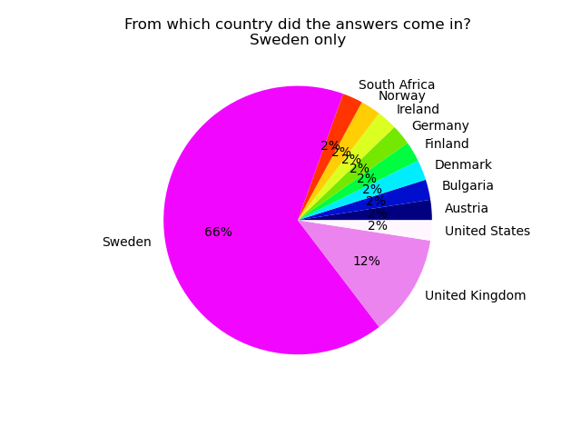

```
                land
land                
Austria            1
Bulgaria           1
Denmark            1
Finland            1
Germany            1
Ireland            1
Neirway            1
South Africa       1
Sweden            27
United Kingdom     5
United States      1
```

## 10. How old are you? (Sweden only)

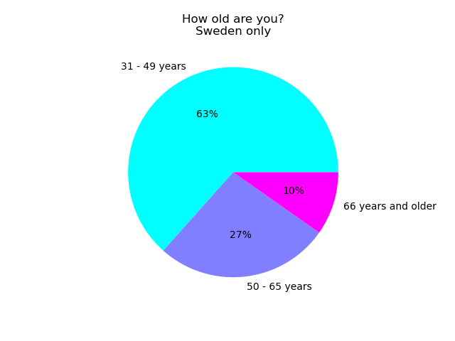

```
             alder
alder             
31 - 49 år      26
50 - 65 år      11
66 og eldre      4
```

## 20. Are you ...? (Sweden only)

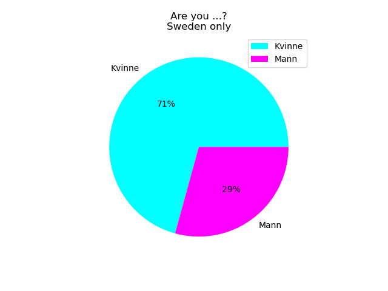

```
        kjonn
kjonn        
Kvinne     29
Mann       12
```

## 30. Do you have an impairment or other condition that affects how you use the internet? (Sweden only)

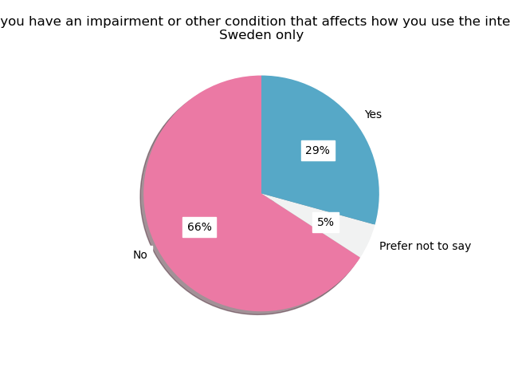

```
                      funksjonsnedsettelse
funksjonsnedsettelse                      
Ja                                      12
Nei                                     27
Ønsker ikke å oppgi                      2
```

## 40. How often do you use the internet? (Sweden only)


```
                       internettvaner
internettvaner                       
Daglig                              4
Flere ganger om dagen              37
```

## 50. How do you generally handle cookie notifications? (Sweden only)

### Subset With vs. Without Impairment (%)

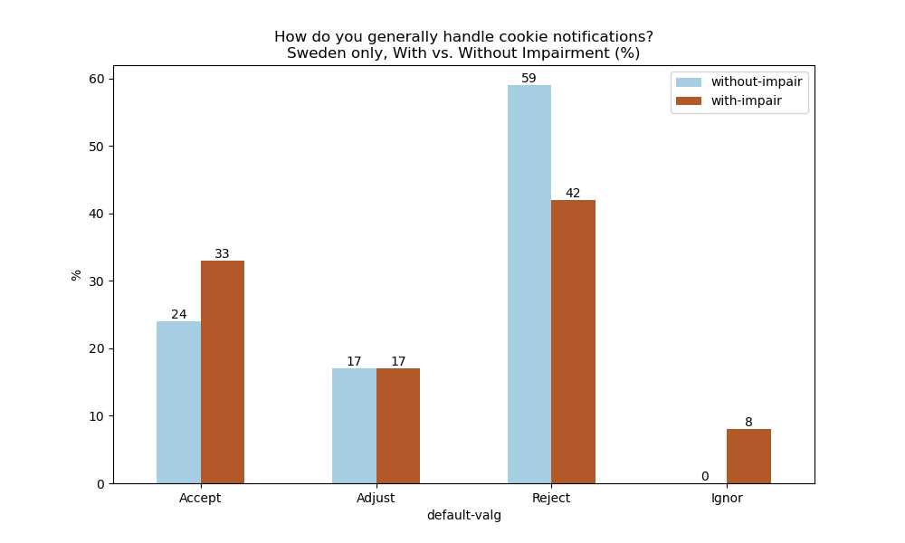

### Subset With vs. Without Impairment (Total #)

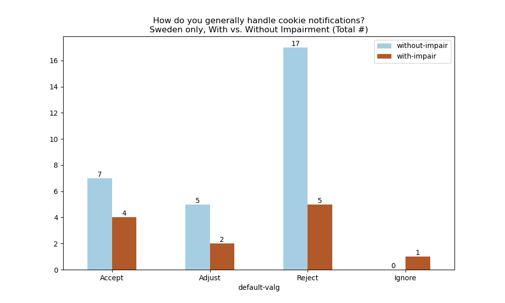

```
              without-impair  with-impair
default-valg                             
Avvise                  17.0            5
Godta                    7.0            4
Tilpasse                 5.0            2
Ignorere                 NaN            1
```

### Subset all abilities

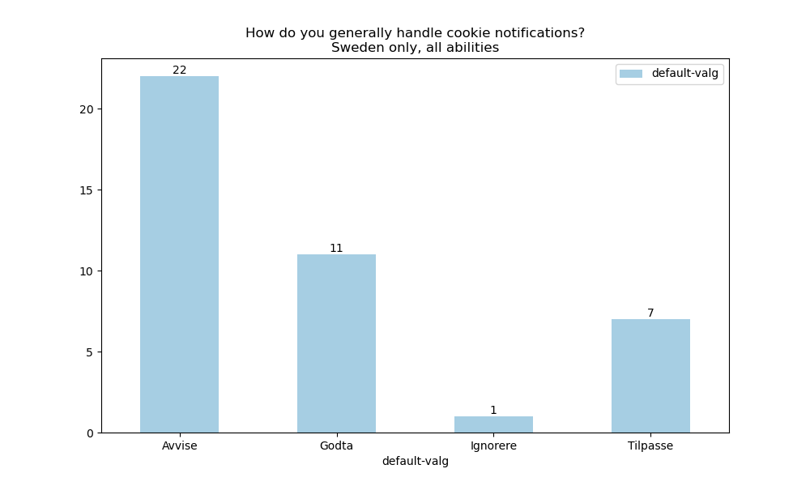

```
              default-valg
default-valg              
Avvise                  22
Godta                   11
Ignorere                 1
Tilpasse                 7
```


## 60. How do you generally find managing cookie notifications? (Sweden only)

### Subset With vs. Without Impairment (%)

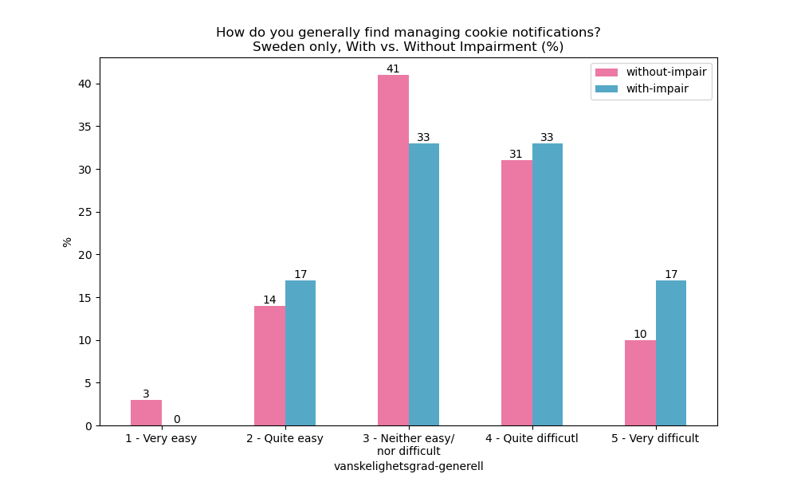

### Subset With vs. Without Impairment (Total #)

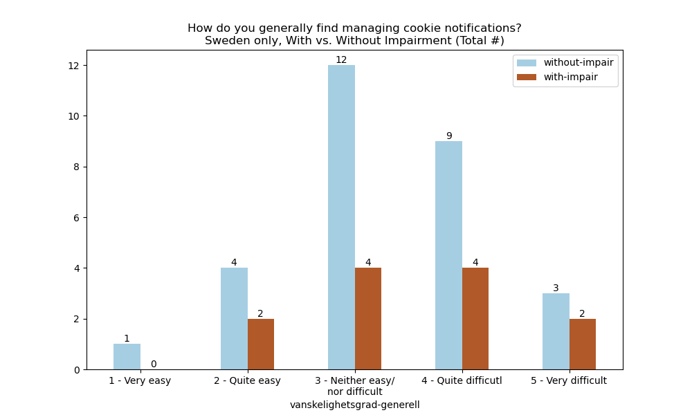

```
                                   without-impair  with-impair
vanskelighetsgrad-generell                                    
1 - Veldig lett                                 1          NaN
2 - Ganske lett                                 4          2.0
3 - Verken lett/\neller vanskelig              12          4.0
4 - Ganske vanskelig                            9          4.0
5 - Veldig vanskelig                            3          2.0
```

### Subset all abilities

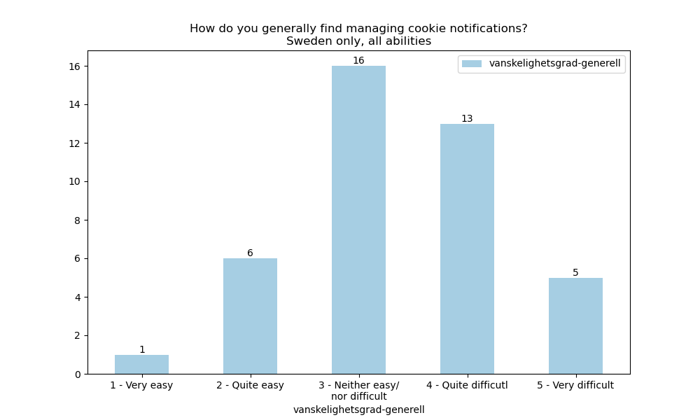

```
                                   vanskelighetsgrad-generell
vanskelighetsgrad-generell                                   
1 - Veldig lett                                             1
2 - Ganske lett                                             6
3 - Verken lett/\neller vanskelig                          16
4 - Ganske vanskelig                                       13
5 - Veldig vanskelig                                        5
```


## 70. What do you generally think about the text in cookie notifications? (Sweden only)

### Subset With vs. Without Impairment (%)

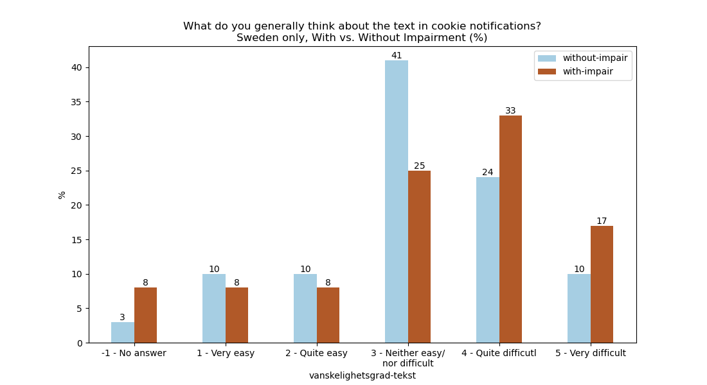

### Subset With vs. Without Impairment (Total #)

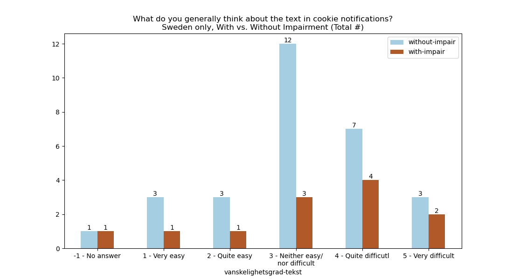

```
                                   without-impair  with-impair
vanskelighetsgrad-tekst                                       
-1 - Svarte ikke                                1            1
1 - Veldig lett                                 3            1
2 - Ganske lett                                 3            1
3 - Verken lett/\neller vanskelig              12            3
4 - Ganske vanskelig                            7            4
5 - Veldig vanskelig                            3            2
```

### Subset all abilities

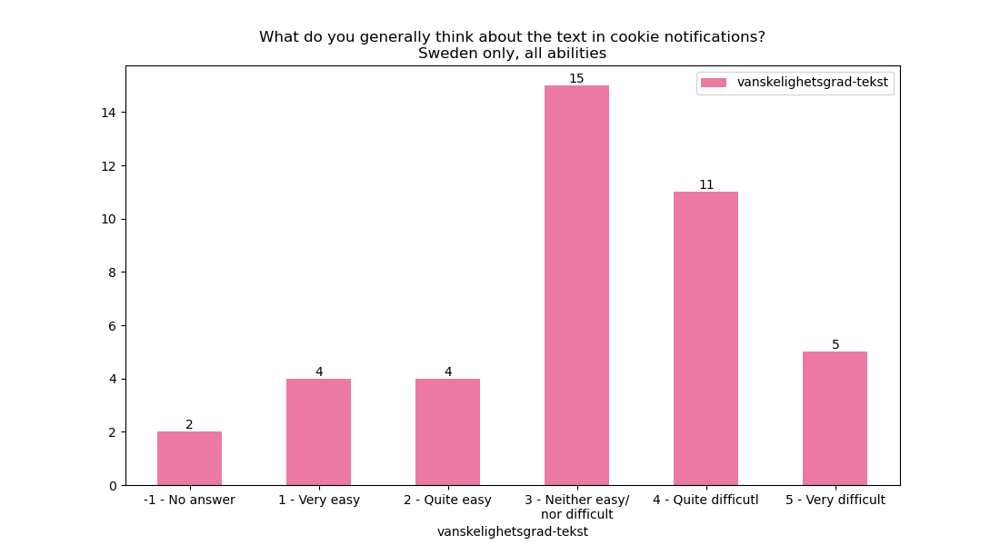

```
                                   vanskelighetsgrad-tekst
vanskelighetsgrad-tekst                                   
-1 - Svarte ikke                                         2
1 - Veldig lett                                          4
2 - Ganske lett                                          4
3 - Verken lett/\neller vanskelig                       15
4 - Ganske vanskelig                                    11
5 - Veldig vanskelig                                     5
```


## 80. Is it generally easy or difficult to make choices for cookies? (Sweden only)

### Subset With vs. Without Impairment (%)

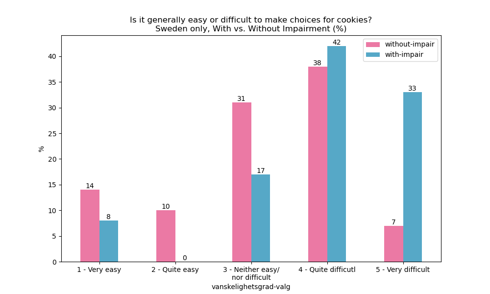

### Subset With vs. Without Impairment (Total #)

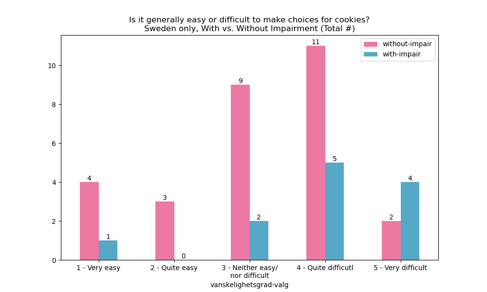

```
                                   without-impair  with-impair
vanskelighetsgrad-valg                                        
1 - Veldig lett                                 4          1.0
2 - Ganske lett                                 3          NaN
3 - Verken lett/\neller vanskelig               9          2.0
4 - Ganske vanskelig                           11          5.0
5 - Veldig vanskelig                            2          4.0
```

### Subset all abilities

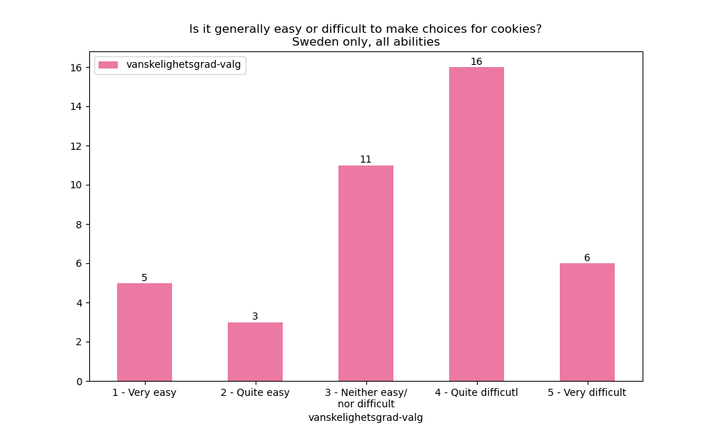

```
                                   vanskelighetsgrad-valg
vanskelighetsgrad-valg                                   
1 - Veldig lett                                         5
2 - Ganske lett                                         3
3 - Verken lett/\neller vanskelig                      11
4 - Ganske vanskelig                                   16
5 - Veldig vanskelig                                    6
```
