# Results from the survey

## From which country did the answers come in?

### Sweden only

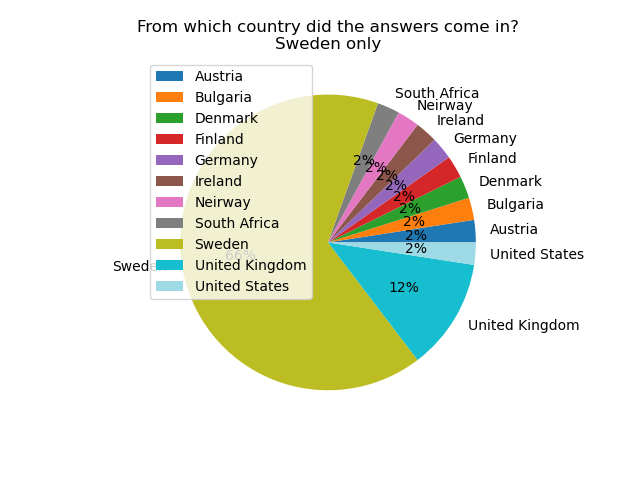

```
                land
land                
Austria            1
Bulgaria           1
Denmark            1
Finland            1
Germany            1
Ireland            1
Neirway            1
South Africa       1
Sweden            27
United Kingdom     5
United States      1
```

## Hvor gammel er du?

### All countries combined

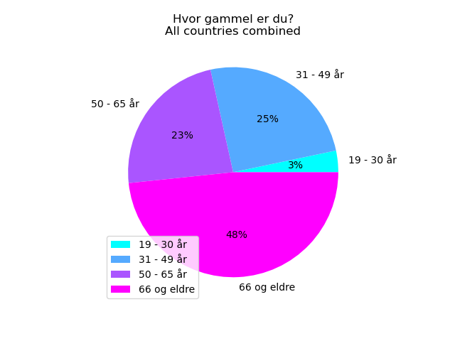

```
             alder
alder             
19 - 30 år       5
31 - 49 år      38
50 - 65 år      35
66 og eldre     73
```

## Hvor gammel er du?

### Sweden only

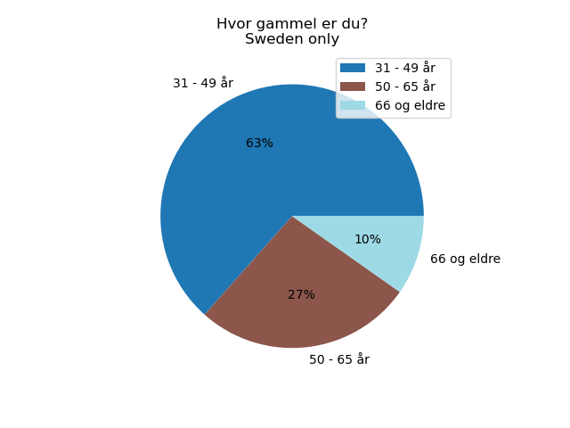

```
             alder
alder             
31 - 49 år      26
50 - 65 år      11
66 og eldre      4
```

## Er du ...?

### All countries combined

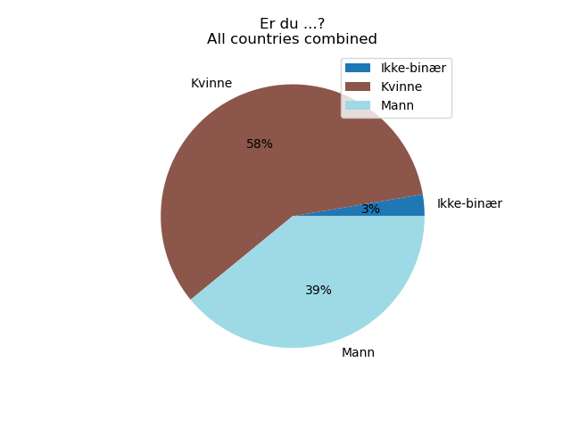

```
            kjonn
kjonn            
Ikke-binær      4
Kvinne         88
Mann           59
```

## Er du ...?

### Sweden only

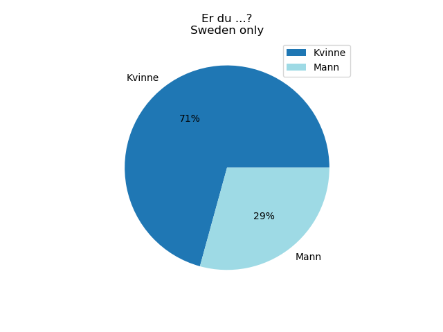

```
        kjonn
kjonn        
Kvinne     29
Mann       12
```

## Har du en funksjonsnedsettelse eller annen tilstand som påvirker hvordan du bruker nettet?

### All countries combined

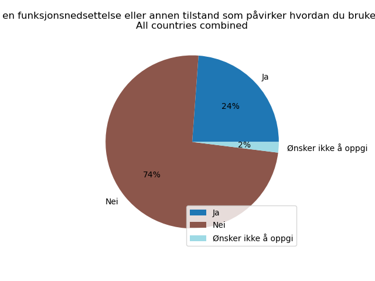

```
                      funksjonsnedsettelse
funksjonsnedsettelse                      
Ja                                      36
Nei                                    112
Ønsker ikke å oppgi                      3
```

## Har du en funksjonsnedsettelse eller annen tilstand som påvirker hvordan du bruker nettet?

### Sweden only

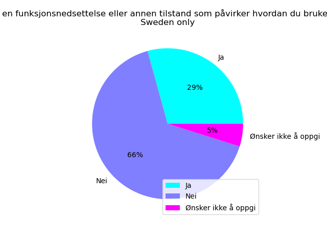

```
                      funksjonsnedsettelse
funksjonsnedsettelse                      
Ja                                      12
Nei                                     27
Ønsker ikke å oppgi                      2
```

## Hvor ofte bruker du Internett?

### All countries combined

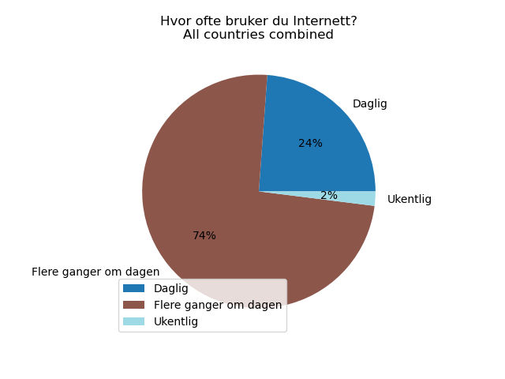

```
                       internettvaner
internettvaner                       
Daglig                             36
Flere ganger om dagen             112
Ukentlig                            3
```

## Hvor ofte bruker du Internett?

### Sweden only

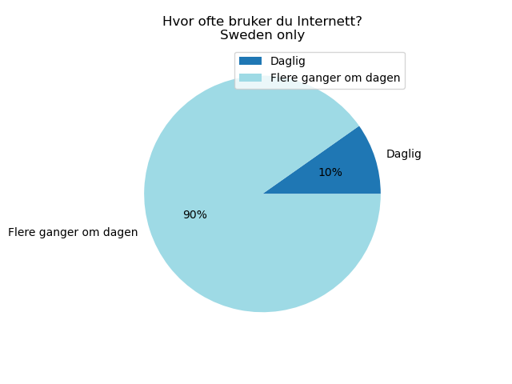

```
                       internettvaner
internettvaner                       
Daglig                              4
Flere ganger om dagen              37
```

## Hvordan håndterer du varsler om informasjonskapsler?

### All countries combined

#### Subset With vs. Witout Impairment (%)

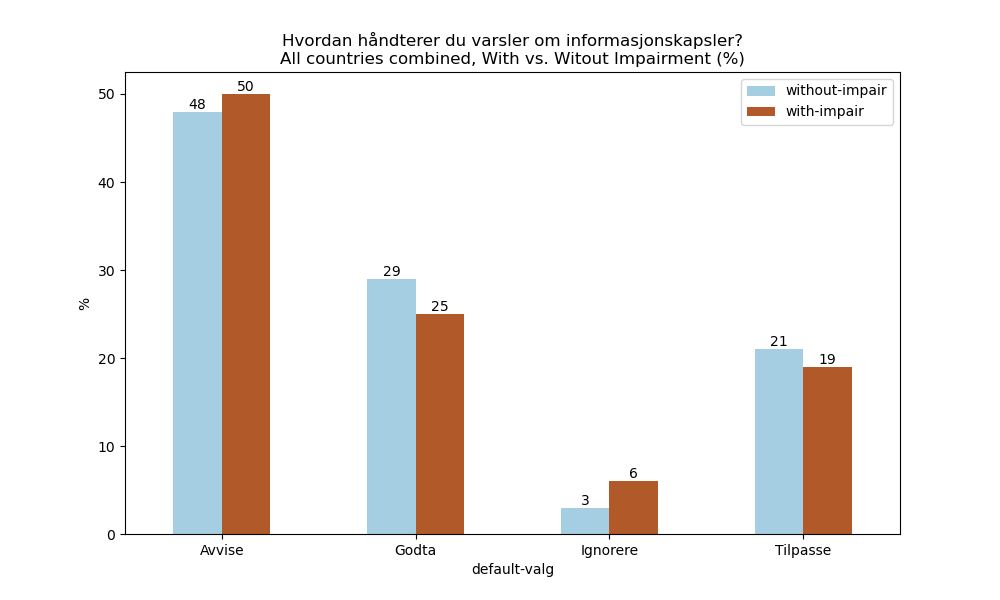

#### Subset With vs. Without Impairment (Total #)

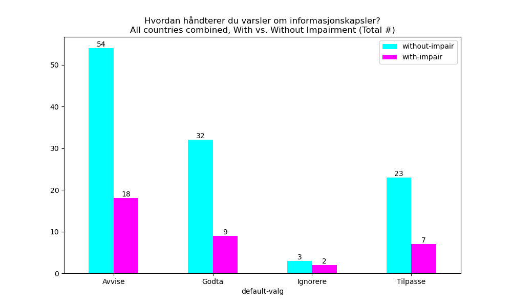

```
              without-impair  with-impair
default-valg                             
Avvise                    54           18
Godta                     32            9
Ignorere                   3            2
Tilpasse                  23            7
```

#### Subset all abilities

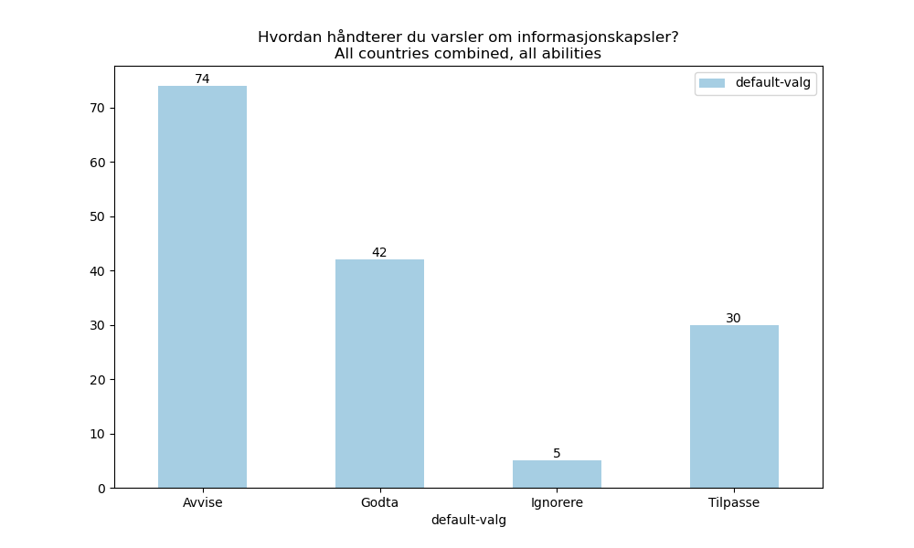

```
              default-valg
default-valg              
Avvise                  74
Godta                   42
Ignorere                 5
Tilpasse                30
```


## Hvordan håndterer du varsler om informasjonskapsler?

### Sweden only

#### Subset With vs. Witout Impairment (%)

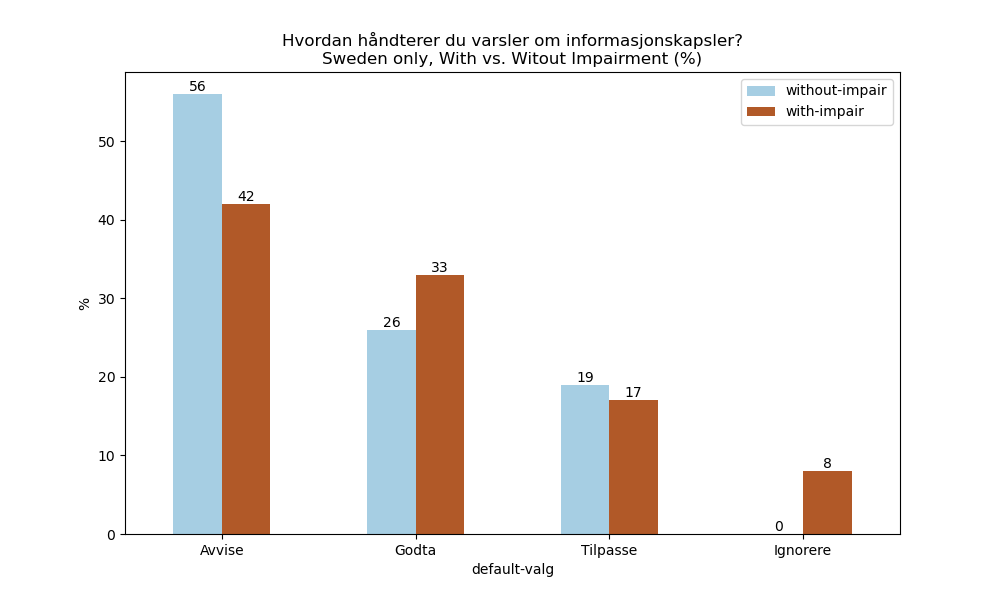

#### Subset With vs. Without Impairment (Total #)

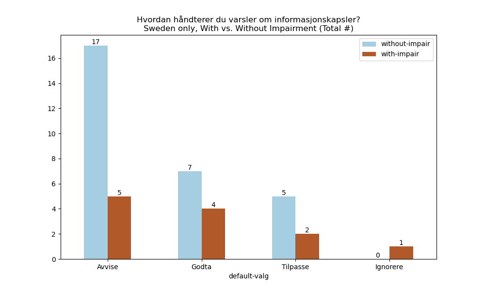

```
              without-impair  with-impair
default-valg                             
Avvise                  15.0            5
Godta                    7.0            4
Tilpasse                 5.0            2
Ignorere                 NaN            1
```

#### Subset all abilities

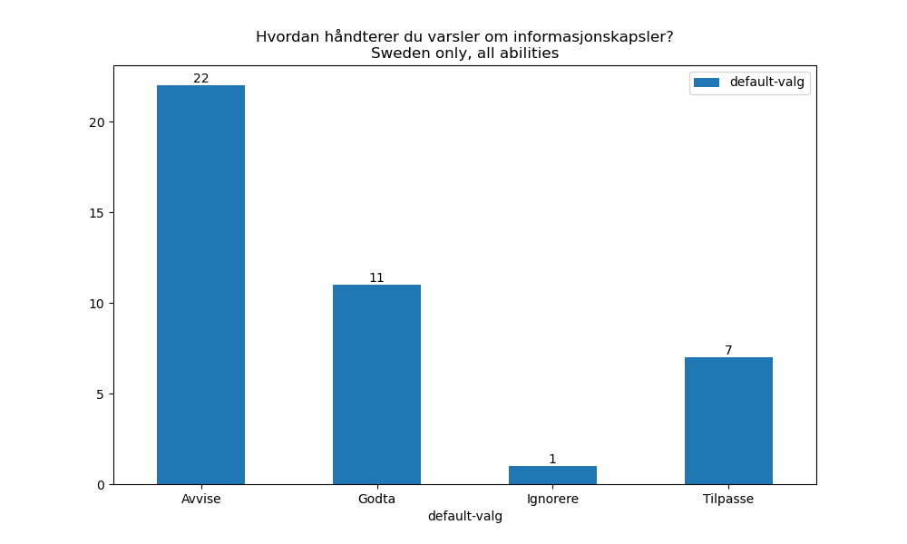

```
              default-valg
default-valg              
Avvise                  22
Godta                   11
Ignorere                 1
Tilpasse                 7
```


## Hvordan opplever du generelt sett å håndtere varsler om informasjonskapsler?

### All countries combined

#### Subset With vs. Witout Impairment (%)

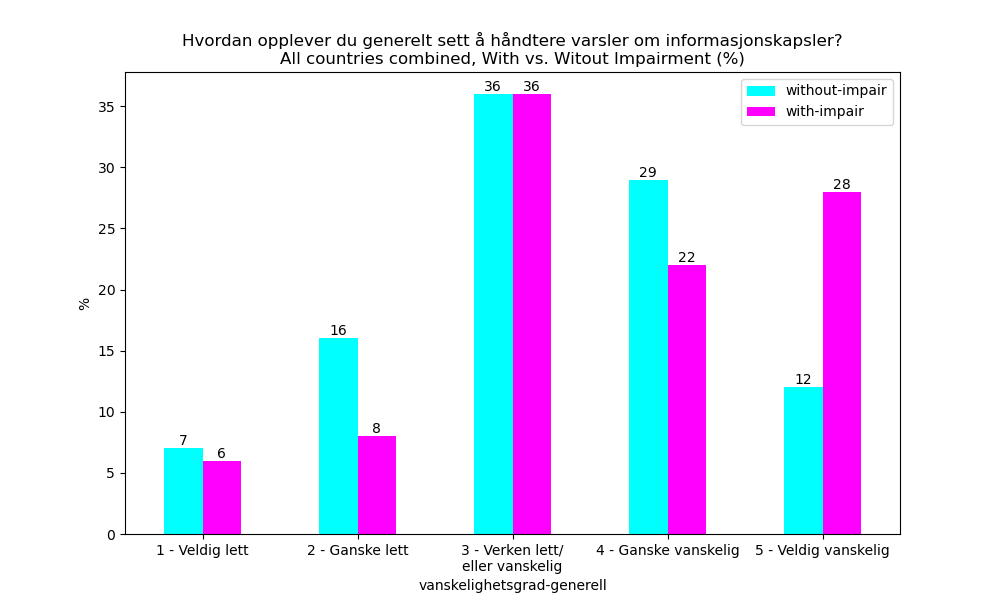

#### Subset With vs. Without Impairment (Total #)

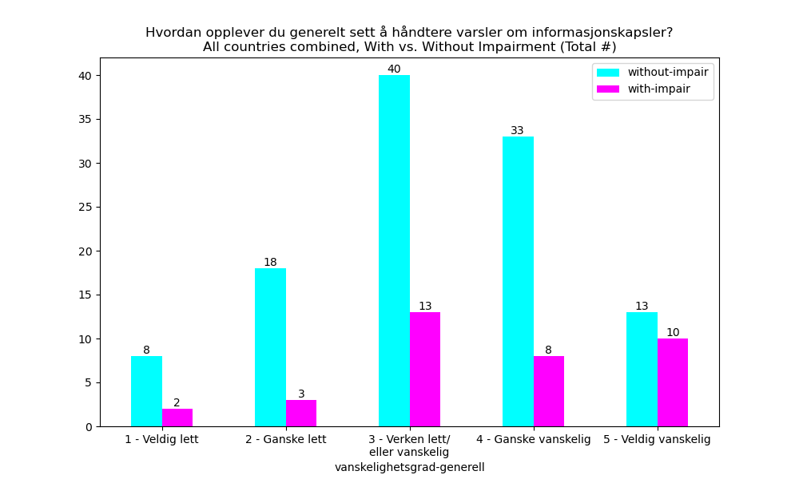

```
                                   without-impair  with-impair
vanskelighetsgrad-generell                                    
1 - Veldig lett                                 8            2
2 - Ganske lett                                18            3
3 - Verken lett/\neller vanskelig              40           13
4 - Ganske vanskelig                           33            8
5 - Veldig vanskelig                           13           10
```

#### Subset all abilities

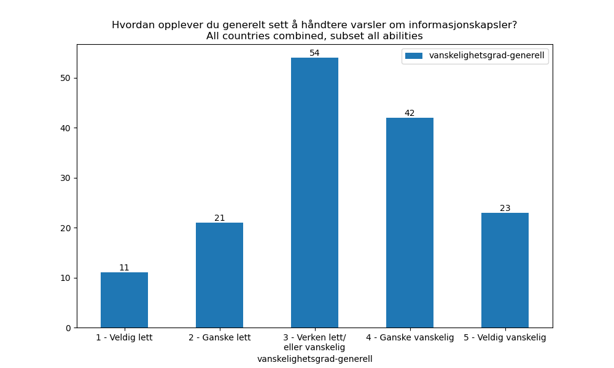

```
                                   vanskelighetsgrad-generell
vanskelighetsgrad-generell                                   
1 - Veldig lett                                            11
2 - Ganske lett                                            21
3 - Verken lett/\neller vanskelig                          54
4 - Ganske vanskelig                                       42
5 - Veldig vanskelig                                       23
```


## Hvordan opplever du generelt sett å håndtere varsler om informasjonskapsler?

### Sweden only

#### Subset With vs. Witout Impairment (%)

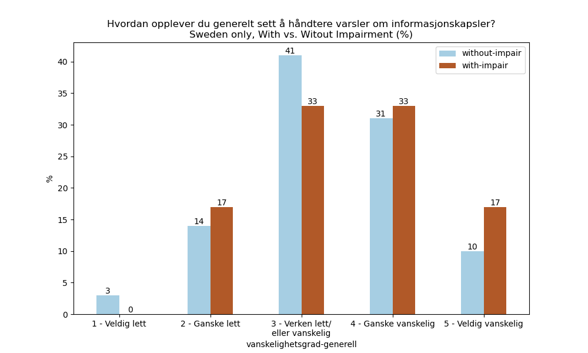

#### Subset With vs. Without Impairment (Total #)

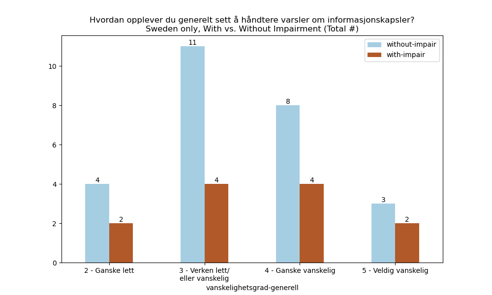

```
                                   without-impair  with-impair
vanskelighetsgrad-generell                                    
1 - Veldig lett                                 1          NaN
2 - Ganske lett                                 4          2.0
3 - Verken lett/\neller vanskelig              11          4.0
4 - Ganske vanskelig                            8          4.0
5 - Veldig vanskelig                            3          2.0
```

#### Subset all abilities

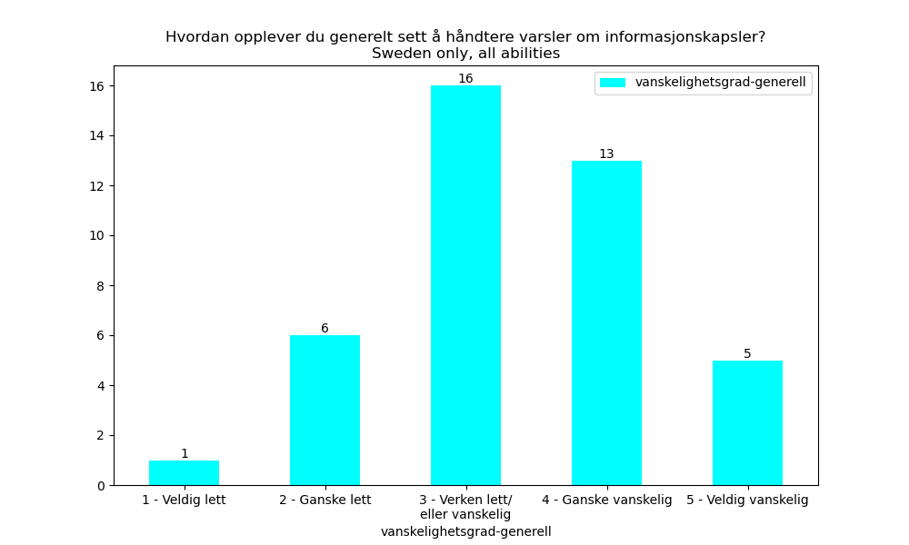

```
                                   vanskelighetsgrad-generell
vanskelighetsgrad-generell                                   
1 - Veldig lett                                             1
2 - Ganske lett                                             6
3 - Verken lett/\neller vanskelig                          16
4 - Ganske vanskelig                                       13
5 - Veldig vanskelig                                        5
```


## Hva synes du generelt om teksten i varsler om informasjonskapsler?

### All countries combined

#### Subset With vs. Witout Impairment (%)

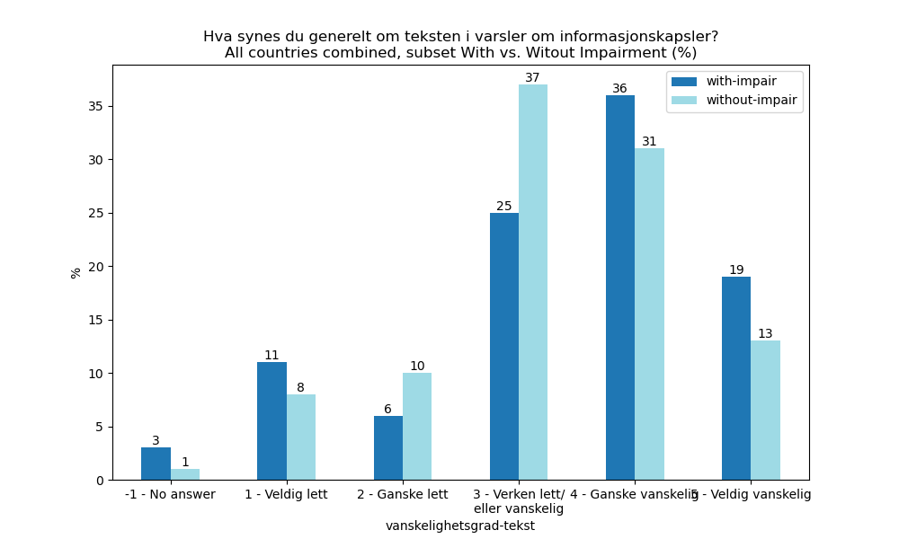

#### Subset With vs. Without Impairment (Total #)

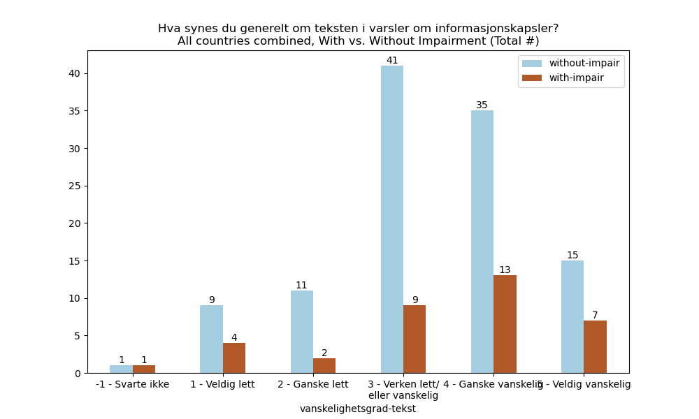

```
                                   without-impair  with-impair
vanskelighetsgrad-tekst                                       
-1 - No answer                                  1            1
1 - Veldig lett                                 9            4
2 - Ganske lett                                11            2
3 - Verken lett/\neller vanskelig              41            9
4 - Ganske vanskelig                           35           13
5 - Veldig vanskelig                           15            7
```

#### Subset all abilities

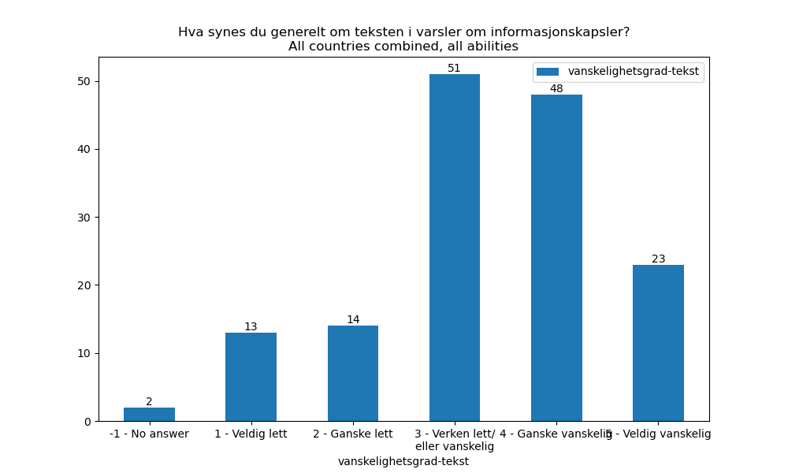

```
                                   vanskelighetsgrad-tekst
vanskelighetsgrad-tekst                                   
-1 - No answer                                           2
1 - Veldig lett                                         13
2 - Ganske lett                                         14
3 - Verken lett/\neller vanskelig                       51
4 - Ganske vanskelig                                    48
5 - Veldig vanskelig                                    23
```


## Hva synes du generelt om teksten i varsler om informasjonskapsler?

### Sweden only

#### Subset With vs. Witout Impairment (%)

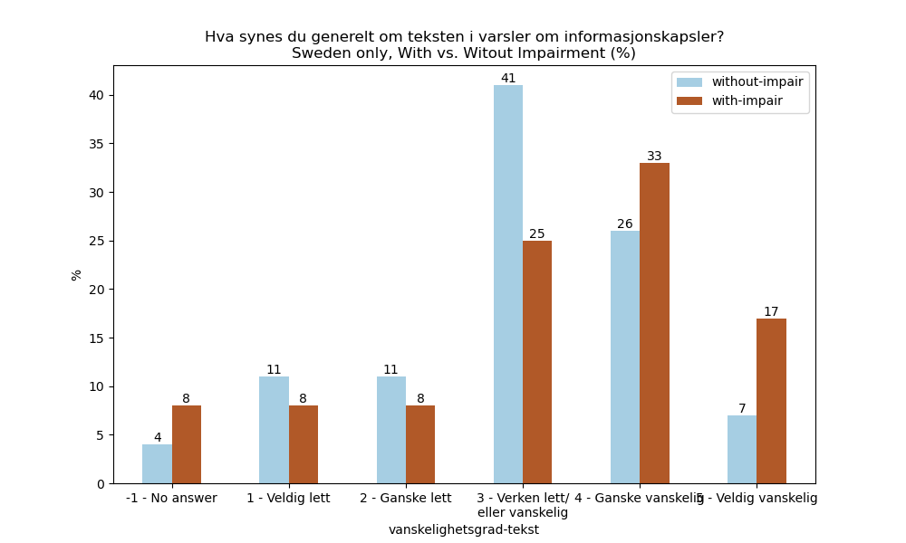

#### Subset With vs. Without Impairment (Total #)

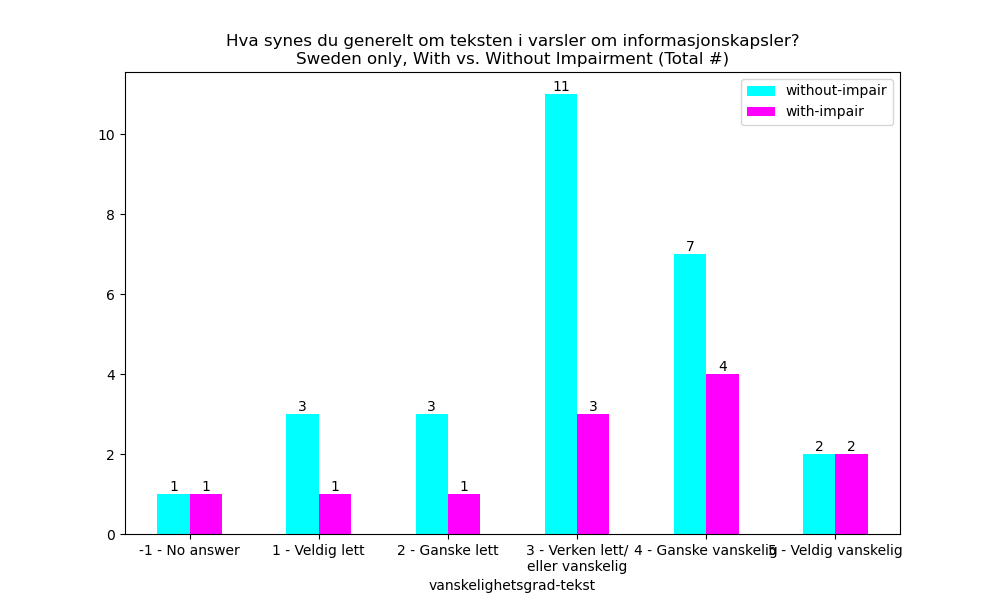

```
                                   without-impair  with-impair
vanskelighetsgrad-tekst                                       
-1 - No answer                                  1            1
1 - Veldig lett                                 3            1
2 - Ganske lett                                 3            1
3 - Verken lett/\neller vanskelig              11            3
4 - Ganske vanskelig                            7            4
5 - Veldig vanskelig                            2            2
```

#### Subset all abilities

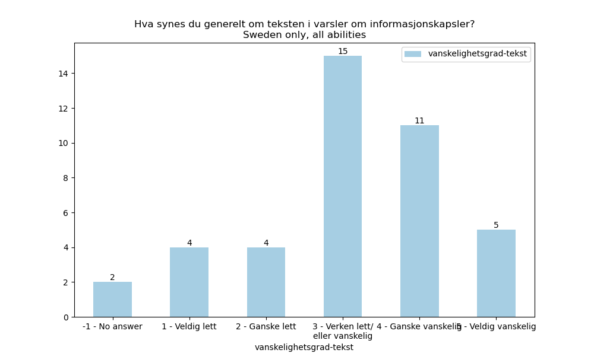

```
                                   vanskelighetsgrad-tekst
vanskelighetsgrad-tekst                                   
-1 - No answer                                           2
1 - Veldig lett                                          4
2 - Ganske lett                                          4
3 - Verken lett/\neller vanskelig                       15
4 - Ganske vanskelig                                    11
5 - Veldig vanskelig                                     5
```


## Er det generelt lett eller vanskelig å ta valg for informasjonskapsler?

### All countries combined

#### Subset With vs. Witout Impairment (%)

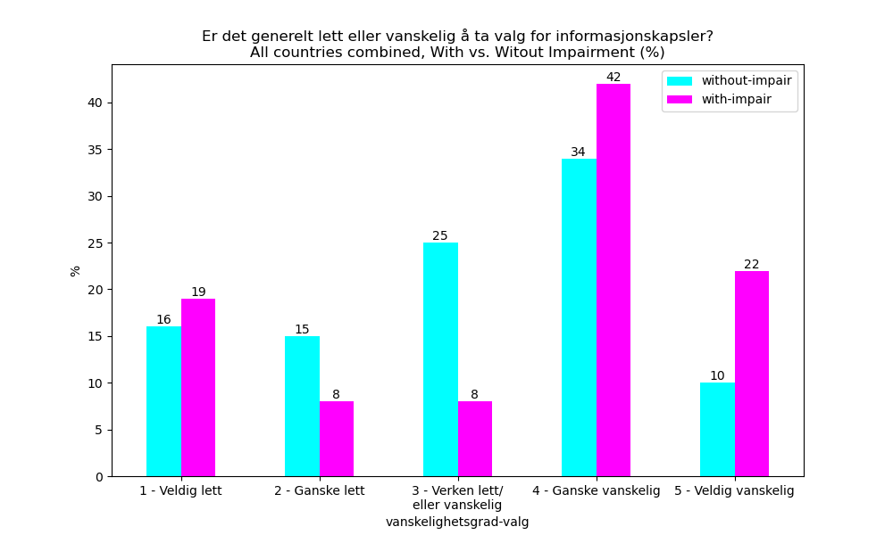

#### Subset With vs. Without Impairment (Total #)

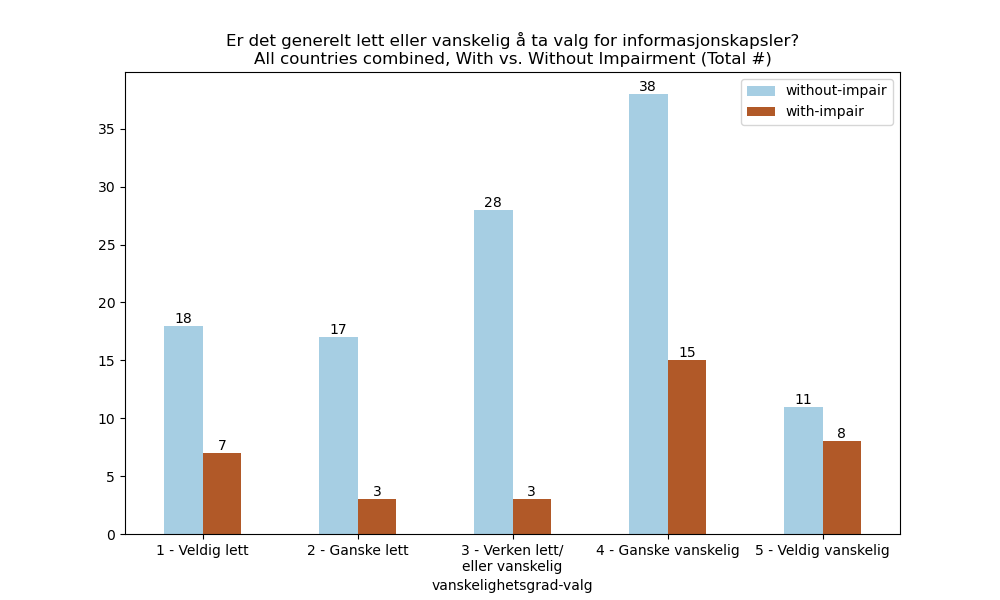

```
                                   without-impair  with-impair
vanskelighetsgrad-valg                                        
1 - Veldig lett                                18            7
2 - Ganske lett                                17            3
3 - Verken lett/\neller vanskelig              28            3
4 - Ganske vanskelig                           38           15
5 - Veldig vanskelig                           11            8
```

#### Subset all abilities

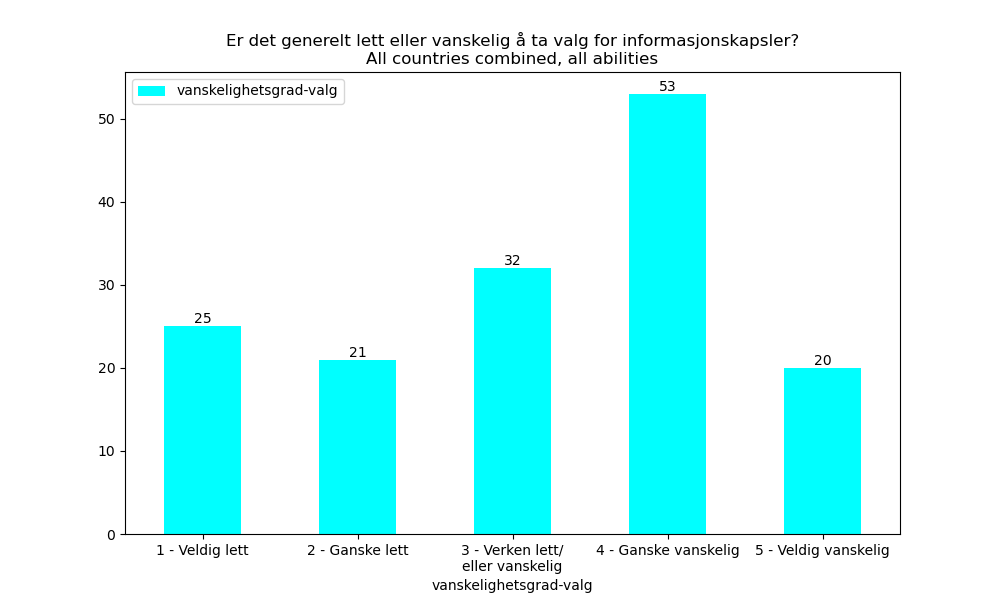

```
                                   vanskelighetsgrad-valg
vanskelighetsgrad-valg                                   
1 - Veldig lett                                        25
2 - Ganske lett                                        21
3 - Verken lett/\neller vanskelig                      32
4 - Ganske vanskelig                                   53
5 - Veldig vanskelig                                   20
```


## Er det generelt lett eller vanskelig å ta valg for informasjonskapsler?

### Sweden only

#### Subset With vs. Witout Impairment (%)

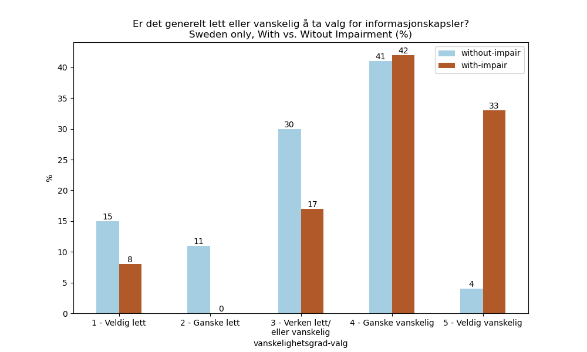

#### Subset With vs. Without Impairment (Total #)

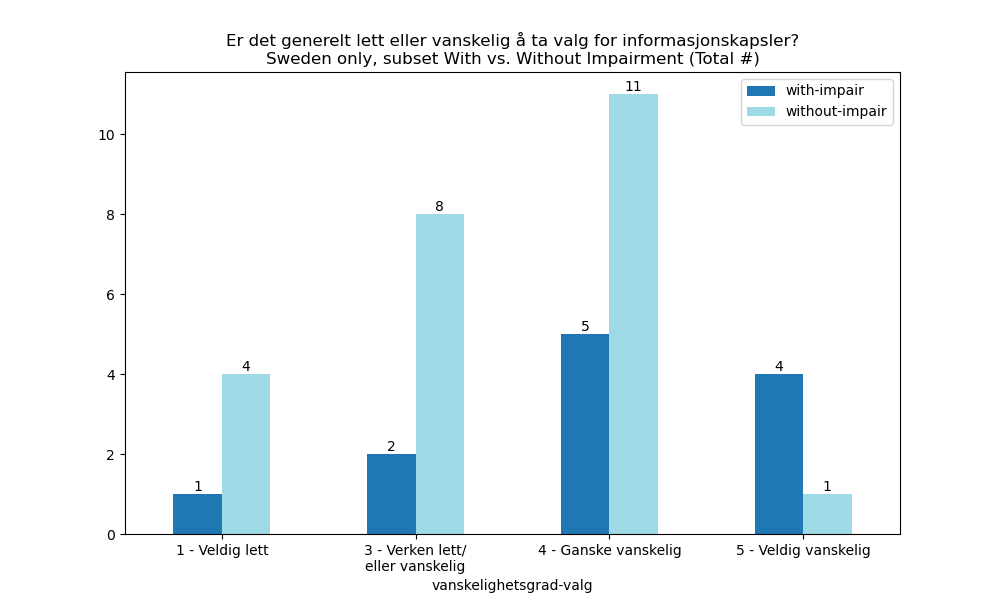

```
                                   without-impair  with-impair
vanskelighetsgrad-valg                                        
1 - Veldig lett                                 4          1.0
2 - Ganske lett                                 3          NaN
3 - Verken lett/\neller vanskelig               8          2.0
4 - Ganske vanskelig                           11          5.0
5 - Veldig vanskelig                            1          4.0
```

#### Subset all abilities

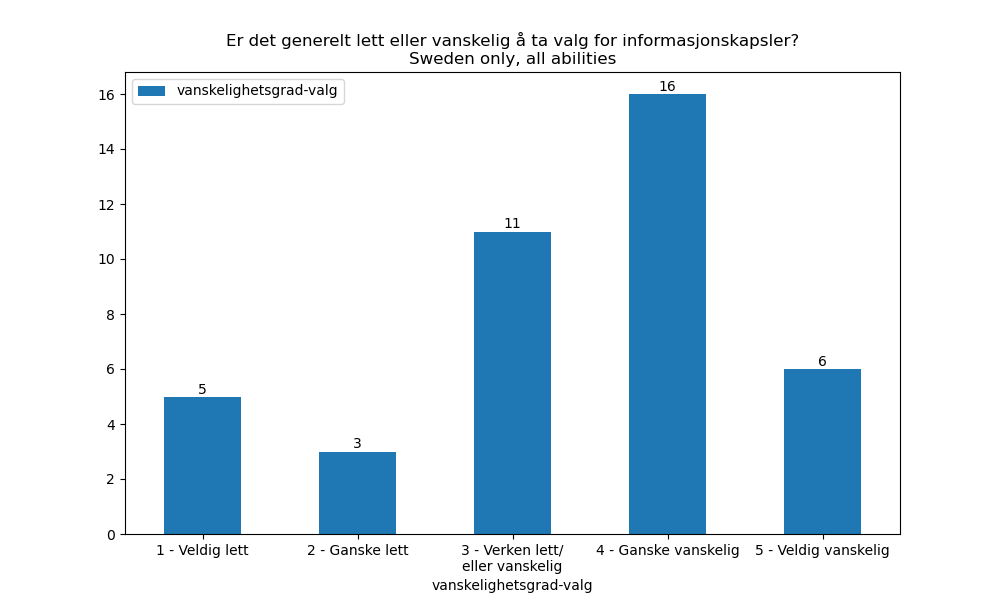

```
                                   vanskelighetsgrad-valg
vanskelighetsgrad-valg                                   
1 - Veldig lett                                         5
2 - Ganske lett                                         3
3 - Verken lett/\neller vanskelig                      11
4 - Ganske vanskelig                                   16
5 - Veldig vanskelig                                    6
```
